# Yangzie PHP 框架开发手册

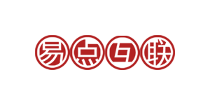

## 第一章 前言

Yangzie 是基于 MVC 的后端 PHP 开发框架，采用 PHP 8 以上版本开发。框架中所有的概念与其他框架类似，但 Yangzie 的目标是"刚刚好，够用就行"。

> 要么成功，要么异常，用 Hook 保持低耦合

在介绍扬子鳄之前，我们必须先介绍扬子鳄的基本原则，因为它贯穿于扬子鳄框架本身的开发，也期望开发者按照这个原则进行开发。

我们认为程序代码的流程不能有太多的分支走向，不能出现不同的返回结果，我们期望它只会成功；但如果因为某些原因程序得不到期望的结果，那么非成功只有一种结果：**抛出异常**。

然后尽可能地梳理好业务流程，多通过 Hook 的方式提高程序的扩展性，减少代码之间的直接依赖。

## 第二章 目录结构

```text
/
├─ README.md
├─ app/
│  ├─ \_\_aros_acos\_\_.php
│  ├─ \_\_config\_\_.php
│  ├─ hooks/
│  │  ├─ auth.php
│  │  └─ autoload.php
│  ├─ modules/
│  │  ├─ graphql/
│  │  │  ├─ \_\_config\_\_.php
│  │  │  └─ controllers/
│  │  │     └─ index.controller.php
│  │  ├─ [模块名]/
│  │  │  ├─ \_\_config\_\_.php
│  │  │  ├─ controllers/
│  │  │  │  └─ index.controller.php
│  │  │  ├─ hooks/
│  │  │  ├─ models/
│  │  │  │  ├─ [模型名].model.php
│  │  │  │  └─ [模型名].method.php
│  │  │  ├─ public_html/
│  │  │  └─ views/
│  │  │     └─ index-index.tpl.php
│  ├─ public_html/
│  │  ├─ .htaccess
│  │  ├─ favicon.ico
│  │  ├─ favicon.png
│  │  ├─ index.php
│  │  ├─ init.php
│  │  ├─ load.php
│  │  ├─ css/
│  │  ├─ js/
│  │  └─ graphql-client/
│  └─ vendor/
│     ├─ save_model_helper.class.php
│     ├─ search_model_helper.class.php
│     ├─ layouts/
│     │  ├─ error.layout.php
│     │  ├─ json.layout.php
│     │  └─ tpl.layout.php
│     ├─ pomo/
│     └─ views/
│        ├─ 404.tpl.php
│        └─ 500.tpl.php
├─ composer.json
├─ i18n/
├─ scripts/ CLI脚本
├─ tests/ //单元测试目录
├─ tmp/
├─ vendor/ //composer的按照目录
└─ yangzie/
```

扬子鳄框架目录如图所示，主要由下面几个目录组成：

- /yangzie 目录是框架核心文件。
- /scripts 是构建脚本目录，用于通过 CLI 方式生成代码文件。
- /tests 是单元测试文件目录，通过 CLI 方式生成的代码都会在该目录下生成对应的单元测试文件，并可以通过 CLI 的方式运行单元测试。
- /tmp 是其他一些临时目录，比如 SSH 的 key 等。
- /app 是功能代码目录，我们编写的功能代码都在其中。
  - \_\_aros_acos\_\_.php 该文件是 ACL 控制配置文件，这将在 ACL 控制中详细说明。
  - \_\_config\_\_.php 是系统的配置文件，包含数据库配置、资源打包绑定、文件自动包含等。
  - hooks 是系统级别的 Hook 注册文件放置目录，这部分会在后面的 Hook 章节中详细说明。
  - modules 是功能模块目录，所有的业务功能代码都会以 modules 的方式放置在这里面，这部分会在 Module 章节中说明。
    - controllers 是所有控制器类文件。
    - models 是所有的 model 文件，model 是与数据库的表对应的类，这将在 Model-数据处理中说明。
    - views 是控制器的方法对应的输出视图，这将在视图系统中进行介绍。
    - hooks 是该模块下的 hooks 文件。
    - public_html 是模块使用的相关资源文件，由于单入口的原因，这里面的文件，前端无法访问，要访问这里的js，css，img等资源需要通过 yze_module_asset_url 接口
    - \_\_config\_\_.php 是模块的配置文件，格式跟 app/\_\_config\_\_.php 一样（app 本身也是一个 module），但这里只做 module 的配置。
  - public_html 是系统访问的入口目录，里面的目录可以自由组织存放。
    - public_html/index.php 就是入口文件。
  - vendor 是其他第三方库、layout、views 等系统公共部分的放置路径。
    - vendor/layout 存放的是系统的布局文件。
    - vendor/views 存放的是公共视图。
- /vendor 是 composer 安装的包。

## 第三章 如何开始写代码

开始用 Yangzie 开发系统时，首先需要从 Yangzie 的 git 库中下载最新版本的代码，git 地址是：<https://github.com/ydhl/yangzie>。

Yangzie 是基于 PHP 8+ 开发的快速开发框架。使用 Yangzie 开发，必须先在本地安装好 WEB 运行环境，你可以选择你喜欢的任意一个 WEB 环境，比如 Apache、Nginx 等，也可以用 PHP 内置 Web Server。你只需要三步即可开始进行开发：

1. cd 进入到项目的 public_html 目录
2. 运行 `php -S localhost:8080` 启动 PHP 内置 Web Server
3. 直接访问 localhost:8080 即可

对于其他 Web Server，由于各自配置不同，请自行配置，但必须要做的是：

1. Yangzie 是单入口框架，必须开启 `rewrite` 或同等功能的配置支持，
2. 配置 index.php 为默认主页
3. 本地环境需要配置虚拟域名，比如 yangzie.local.com，并把域名指向你本地 Yangzie 的 public_html 目录。
   1. 在本地 host 加上路由设置，让 yangzie.local.com 指向 127.0.0.1
   2. 在你的 Web Server 上配置虚拟域名指向 public_html
4. 访问你的虚拟域名

开发环境就搭建好了，接下来要做的就是通过 Yangzie CLI 生成你的代码，开始你的系统开发。

### 第一节 Yangzie CLI

Yangzie CLI 位于 scripts 中，其作用是：

1. 生成代码的脚手架
2. 根据数据库表生成对应的 Model
3. 运行单元测试
4. Phar 打包 Module 等

相应的功能用法会在相应的章节中说明，这里主要说明如何通过 CLI 生成代码结构，因为这是 Yangzie 开发必须要做的第一步。
要运行 CLI，打开你电脑的终端命令行，进入到 Yangzie 的目录中，有两种方式运行：

一是向导方式，二是 CLI 方式。

向导方式：

```php
php scripts/yze.php
```

需要确保命令行能执行 php，如果是 Windows 环境，则需要把 php.exe 添加到环境变量中。
如果出错了，请根据错误提示对应解决。
生成数据模型文件时，CLI 也会通过 app/\_\_config\_\_.php 访问数据库，所以请确保里面的数据库配置是否正确。
要做什么只需要输入对应的数字即可。执行完成后，即可在目录中看到对应的目录结构，CLI 会生成对应的 module 和单元测试文件，如图所示：

```text
├─ hello/
│  ├─ controllers/
│  │  └─ index.controller.php
│  ├─ hooks/
│  ├─ models/
│  ├─ public_html/
│  ├─ views/
│  │  └─ index-index.tpl.php
│  ├─ \_\_config\_\_.php
```

Yangzie 采用模块化开发业务功能，modules 下面每个目录就是一个独立的模块。至于一个系统应该怎么划分模块、每个模块如何命名，由你决定。

每个模块的结构和 app 目录基本一致（app 也是一个 module）。模块自己的静态资源包，可以选择放在模块的 public_html 里面的任何位置，然后在 \_\_config\_\_.php 中通过 js_bundle 和 css_bundle 方法打包，用法和 app/\_\_config\_\_.php 一致，这在 View 部分会做说明。

Tests 中会以模块名创建对应的单元测试文件，这部分会在单元测试中详细说明。

CLI 模式和向导模式的区别是，需要把参数直接指定，一次完成，更多关于 CLI 的用法请参考[Yangzie CLI手册](cli.md)

------

### 第二节 路由、action 和 view 简介

创建好 module 后，就可以开始编写功能逻辑了。Web 系统开发主要处理三件事，依次是：

1. 在 controller 处理请求
2. 操作数据库或者其他后端逻辑
3. 返回内容给前端，比如返回 view 给浏览器

那么首先需要明确的是，一个请求该怎么响应，这里有几个概念：请求地址，路由，控制器，action和响应；
请求地址是客户端访问的地址，该地址经过路由规则后需要进入到某个控制器的方法（action）中，该action在处理后需要返回响应给客户端，他们的关系如下：
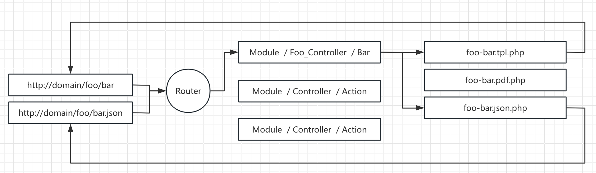

控制器、action和响应都是已module来组织的，怎么路由由yangzie的Router来负责，Router会根据module中\_\_config\_\_.php的路由配置来进行路由，如果没有路由配置，则会把地址中的path部分按照module/controller/action的格式来解析，没有的用index代替，比如：

1. http:\/\/domain/foo/bar/test, 会路由到foo模块bar控制器中的test方法
2. http:\/\/domain/foo/bar, 会路由到foo模块bar控制器中的index方法
3. http:\/\/domain/foo, 会路由到foo模块index控制器中的index方法

详细的路由配置见后续`URL 路由`部分。

现在你已经创建好了一个 module，那么你只需要打开浏览器访问你定义的 URL route，便可在浏览器上看到一个简单的内容输出：

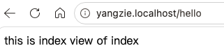

action 是 controller 对象中处理请求的方法，是主要处理请求逻辑的地方，这里要做的工作是：

1. 通过 Request 对象获取请求的数据，比如 GET、POST、SESSION 等
2. 逻辑业务处理，比如数据库读取、写入等
3. 返回响应，通过 Controller 的 `$this->set_view_Data("name","value")` 给 view 传递数据；也可以通过 return YZE_JSON_VIEW 返回 JSON，或者 return YZE_REDIRECT 返回重定向等

Action 代码的最佳实践：

1. 不要在代码里面直接输出，这将会破坏框架的输出控制，返回的内容都通过响应对象进行返回
2. 四段式编写，把代码分成四部分：1. 先获取需要的请求数据，2. 对数据进行合法验证，3. 处理具体的业务逻辑，4. 返回响应
3. 按照扬子鳄原则进行处理，出现错误情况，抛出异常，交给框架去处理

View 就是指需要返回给调用端的响应内容。它可能是一个展示在浏览器上的界面，也可能是一个 JSON 结构体，甚至是一个 PDF 文件。这是 Yangzie 框架独特的地方：同一个请求可以返回不同的响应格式。

默认情况下返回的是界面，界面是 PHP 和 HTML 的混合体。界面文件位于 module 的 views 目录中，它与 action 的对应关系通过文件名的命名约定进行关联。view 文件的命名格式是 [controller name]-[action name].[view format].php，其中 view format 默认是 tpl，代表展示界面；如果是 json，代表输出 JSON；如果是 pdf，代表输出 PDF。格式由开发者自定义，详细会在视图部分介绍。

对于要输出的数据，控制器处理好后会通过 set_view_data 传递过来，在 view 中只需通过 $this->get_Data("name") 获取数据，然后按照传统的 PHP 输出方式输出内容即可。

你可以在 controller 中尝试 set_view_data，然后在 tpl.php 文件中通过 $this->get_Data 获取并输出，看看效果。

到此一个简单的 URL 处理逻辑就完成了，当你了解后面的高级功能后便可写更加复杂的系统代码了。

### 第三节 数据库配置简介

在 app/\_\_config\_\_.php 的 config 方法中返回数据库配置：

```php
protected function config(): array{
    return [
        'default_db' => 'test1', // 默认链接的数据库名，请填写项目实际的数据库名
        'db_connections' => [
            'yangai' => [
                'db_type' => $this->env('yangai.db_type', 'mysql'),
                'db_host' => $this->env('yangai.db_host', '127.0.0.1'),
                'db_user' => $this->env('yangai.db_user', ''),
                'db_psw'  => $this->env('yangai.db_psw', ''),
                'db_port' => $this->env('yangai.db_port', ''),
                'db_charset'=> $this->env('yangai.db_charset', ''),
                'crypt_key'=> $this->env('yangai.crypt_key', ''),
                'db_params' => [\PDO::MYSQL_ATTR_USE_BUFFERED_QUERY=>true],
            ],
            'test2' => [
                'db_type' => $this->env('test2.db_type', 'mysql'),
                'db_host' => $this->env('test2.db_host', '127.0.0.1'),
                'db_user' => $this->env('test2.db_user', ''),
                'db_psw'  => $this->env('test2.db_psw', ''),
                'db_port' => $this->env('test2.db_port', ''),
                'db_charset'=> $this->env('test2.db_charset', ''),
                'crypt_key'=> $this->env('test2.crypt_key', ''),
                'db_params' => [\PDO::MYSQL_ATTR_USE_BUFFERED_QUERY=>true],
            ],
        ]
    ];
}
```

数据库配置信息配置在项目根目录的.env文件中或者系统环境变量里，配置的名字可自行处理，见.env部分说明，当然也可以直接配置在代码中。
Yangzie 的数据库处理，支持分库分表，支持数据库字段的存储加密和读取解密，支持数据库的读写分离，这些都是 Yangzie 框架自带的功能，无需开发者处理，只需要配置好即可。这里只简单做个数据库的配置了解，后面数据库处理中再做详细介绍。

接下来我们将详细介绍 Yangzie MVC 框架的各个组成部分。

## 第三章 Module 模块

> CLI: php scripts/yze.php --mvc -C=控制器名 -M=模块名 -a=方法名 -r=映射url[可选]

Module 是扬子鳄的业务功能模块单元。在设计上，扬子鳄的理念是希望把相关的功能看作一个"模块"，模块与模块之间尽可能独立、低耦合；每个模块都包含完整的 MVC 结构、URL 映射及其自己的资源包。模块位于 app/modules 下面，每个 module 包含的目录有：

- controllers 里面放置控制器类代码，每个控制器是一个独立的文件，文件命名规则是：[控制器名].controller.php，并且都是小写的；类名是[控制器名]_Controller，控制器名按驼峰命名法首字母大写，但单词之间用下划线分割。
- models 放置该模块的数据模型对象，每个数据模型对象对应一个数据库表

    文件命名是[数据对象名].model.php；类名是[数据对象名]_Model。
    数据文件分成模型定义文件和业务逻辑文件，模型定义文件是数据模型对象的定义，由框架生成，所以开发者不要修改里面的内容。
    业务逻辑文件是数据模型对象的业务逻辑处理，开发者写的业务逻辑方法都在该文件中，业务逻辑文件采用php的trait机制，文件的命名规则是[数据对象名].method.php。类名是[数据对象名]_Method。
    文件名都小写；对象名按驼峰命名法首字母大写，但单词之间用下划线分割

- views 放置 controller 的视图，每一个 action 对应一个 view 文件，文件名规则是：[控制器名]_[action名].[view format].php，默认的 view format 是 tpl，详细见视图部分
- hooks 放置模块下面的 hook 文件，下面的文件是自包含的，在对应的 hook 被触发时调用里面注册的钩子函数
- \_\_config\_\_.php 是模块的配置文件，主要配置 URL 映射和是否需要登录认证

### 第一节 \_\_config\_\_.php 文件

App 目录及其每个 module 目录中都有该文件，本质上 app 也是一个 module。该文件的目的是配置相关常量、在系统启动处理流程前做必要的检查、进行静态资源打包等。app/\_\_config\_\_.php 用来对整个项目进行配置和设置，模块下的是对模块进行配置，他们都继承`YZE_Base_Module`，提供了如下四个方法

1. check 启动前做系统检查、环境检查等工作:
    方法是系统启动时会最先调用的方法，可以用来检测系统必须要的配置、必须加载的 PHP module 等，有问题则抛出异常。可以在 app/\_\_config\_\_.php 中实现；如果是个可重用的 module，也可以在 module 自己的 \_\_config\_\_.php 的 check 中做好相关的检查
2. config 返回配置项数组:
    在 app/\_\_config\_\_.php 中返回系统级配置，比如数据库配置，见数据库配置部分；
    include_files 配置项部分配置系统自动加载的文件数组，这些文件无法按照yangzie 命名约定实现自动加载，需要手工配置，配置的文件以xiangzie的跟目录做为相对路径，可以时目录也可以时具体的文件，如果指定目录，则自动包含里面的所有文件, 但要注意是按文件名排序顺序包含的，如果被包含的文件之间有依赖关系，这会导致代码错误，这种情况请手动添加包含的文件。默认的设置是加载composer的autoload.php

    ```php
    'include_files'=>[
        "vendor/autoload.php"
    ]
    ```

    当通过composer安装的所有文件，yangzie都无需做任何设置即可自动包含

    在 module 的 \_\_config\_\_.php 中则返回该模块的 url 映射配置，通过 CLI 在创建代码时指定的 url route 就记录在这里，格式如下：

    ```php
    protected function config(){
        return [
            'name'=>'模块名',
            'routers' => [
            //**'要映射的*uri，支持正则*' => [*
            //'controller' => 'controller name',
            //'action' => 'action name',
            // 通过$request->get_var('foo')获取
            //'args' => [
            //"foo" =>  "bar"
            //],
            //],
            ]
        ];
    }
    ```

3. js_bundle 打包 js 资源，用于传统SSR渲染时返回打包js资源文件, 这在 View 部分会做说明
4. css_bundle 打包 css 资源，用于传统SSR渲染时返回打包js资源文件,这在 View 部分会做说明
5. 对于 module 的 \_\_config\_\_.php，多了两个配置属性 auths 和 no_auths，分别用于控制该模块中需要登录认证的 url 和不需要登录认证的 url。需要登录认证则表示框架在处理这些 url 的请求时，会先判断用户是否登录，如果没有登录会抛出异常并跳转到登录页面，见登录认证部分

app/\_\_config\_\_.php中可以用来定义系统常量，默认有如下几个，其他自定义常量也建议定义在该文件中：

- YZE_UPLOAD_PATH：设置上传的本地保存目录，可以是本地目录和任何支持 PHP Stream 的目录；
- SITE_URI 是网站的网址
- UPLOAD_SITE_URI 是 YZE_UPLOAD_PATH 中上传文件的访问地址，Yangzie 建议数据库中的文件存放相对地址，然后通过加上该域名进行访问
- 其他系统的常量都建议定义在该配置文件中。

每个模块下的 \_\_config\_\_.php 也可以定义常量，为了避免名称冲突，建议模块中的常量以模块名开头。

### 第二节 URL 路由

对于后端 Web 框架，必须要处理的一个工作就是 URL 映射。扬子鳄采用单入口模式，这也是为什么需要 Web Server 支持 rewrite 的原因。以apache为例（该文件是 Apache 的规则文件，不同的 web server 处理方式不一样）在扬子鳄的工作目录 public_html 中有一个 .htaccess 文件，里面定义了 rewrite 的规则，比如 Apache 下面是这样子的：

```text
<IfModule mod_rewrite.c>
   RewriteEngine On
    RewriteCond %{REQUEST_FILENAME} !-d
    RewriteCond %{REQUEST_FILENAME} !-f
    RewriteRule ^(.*)$ index.php?url=$1 [QSA,L]
</IfModule>
```

不管哪种配置，其目的都是一样的：把所有的请求都转发到 public_html/index.php 中，而 index.php 是 Yangzie 的处理入口。

URL 路由由 YZE_Router 负责，这是一个全局单例对象，在一个请求的整个处理流程中它是唯一的。该对象的作用是管理整个系统的所有 URL 映射，在请求开始处理时，负责把系统中所有模块的 URL 映射读取出来，以便请求到来时知道某个 URL 由哪个 controller 的 action 处理。

请求的地址和action的关系如下：


自定义路由在模块的 \_\_config\_\_.php 中定义，格式如下：

```php
 protected function config(){
    return [
        'name'=>'模块名',
        'routers' => [
            'test/add' => [
                'controller' => 'index',
                'action'=>'add',
                'args' => ["name" => "value"]
            ],
            'test/(?P<id>\d+)/edit' => [
                'controller' => 'index',
                'action'=>'edit',
                'args' => []
            ],
        ]
    ];
 }
```

上图演示了两个 URL 样例：

1. test/add：当访问你的域名/test/add 时，就会进入 test 模块的 index 控制器的 add 方法
2. test/(?P\<id\>\d+)/edit：当访问你的域名/test/1234/edit 的时候，就会进入 test 模块的 index 控制器的 edit 方法，并且在该方法中通过 $request->get_var('id') 可以获得地址上的path参数 1234

映射 URL 不能以 / 开头或结尾，并且只需填写域名中的路径部分，比如 http:\/\/yangzie.local.com/test/1234/edit 中的 test/1234/edit。从上图可以看出，映射的 URL 支持正则匹配，你可以完全自定义、设计你的地址，让地址更具有可读性。上图中的 (?P\<id\>\d+) 就是匹配地址中的数字部分，并把匹配的数字放到以 id 命名的"path参数"中，这是一种动态获取地址数据的方法；而 args 中的数组则是静态传入控制器的参数，也就是程序写死的。当某些不同的 URL 映射到同一个 action，但 action 中的代码需要区分来源时，设置静态传入参数是一种可选项。

控制器获取地址上映射的Path参数，或者路由配置写死，则通过 `$this->get_var("参数名")` 获取。

路由映射配置并不是必须的。如果没有配置路由，当用户访问一个网址时，扬子鳄会默认按照 module/controller/action 的方式去解析地址并寻找对应的 action。比如当用户访问 http:\/\/yangzie.local.com/test 时，扬子鳄会把 /test 部分按照 module/controller/action 的方式去解析，没有指定则默认使用 index，所以解析结果就是：

1. /test：模块 test，控制器是 index，action 是 index
2. /test/foo/bar：模块 test，控制器是 foo，action 是 bar
3. /test/foo：模块 test，控制器是 foo，action 是 index

如果对应的 module、controller、action 找不到，Yangzie 会报错并进入错误处理页面。

#### 默认主页

一个特殊情况是，直接访问域名时，Yangzie 会寻找 URL 为""的映射，如果找不到，则进入 Yangzie 的默认主页。开发者需要根据情况，把""映射添加到某个模块中，指定具体的 action 响应主页请求，比如把默认主页用于登录界面：

```php
protected function _config() {
    return array(
        'name' => 'Common',
        'routers' => array(
            '' => array(//登陆
                'controller' => 'login',
                "action" => "index"
            )
    )
}
```

### 第三节 登录认证

登录功能是后台管理系统最基本也是最常见的功能。Yangzie 作为开发框架只处理了登录处理流程中的两个部分：

1. 设置哪些 URI 访问需要进行身份认证
2. 判断需要认证的 URI 访问是否已经通过认证了

而登录认证具体如何认证，由开发者自己处理。通过 HOOK，Yangzie 框架可以把它们自然地串联起来。

#### 配置哪些 URI 需要/不需要登录认证

我们已经知道一个 URI 是跟一个具体的 Module/controller/action 挂钩的，要控制某个 URI 访问前需要登录，其实也就是控制某个 action 需要登录，通过在模块的 \_\_config\_\_.php 中配置即可实现，配置分为两个部分：

1. public $auths：该配置设置模块中哪些 action 需要登录认证
2. public $no_auths = array ()：该配置设置模块中哪些 action 不需要登录认证
3. no_auths 优先级最高 auths

注意这里的配置仅仅是做是否登录的验证，而不是权限的验证，权限验证见权限控制部分，大概有如下几种情况：

1. 默认是 `$auths=[]`、`$no_auths=[]`，表示该模块中所有的内容都不需要登录认证
2. `$auths="*"` 表示所有请求都需要做身份认证
3. `$auths=['controller name'=>"*"]` 指定的控制器名下的所有处理都需要登录认证，其他控制器则不需要
4. `$auths=['controller name'=>'action名或正则表达式']` 指定的控制器名下满足条件的 action 都需要登录认证，其他控制器则不需要
5. `$no_auths` 的配置规则同 `auths`，并且它的优先级高于 `auths`，表示满足条件的 action 不需要登录认证

#### 开发者通过 hook 处理自己系统的登录逻辑

**设置或获取登录用户：**：

1. `YZE_HOOK_GET_LOGIN_USER`：该 hook 用于返回当前登录"用户"，确切地说是返回一个表示当前用户已登录的标识。一般这个标识都是存储在 SESSION 中的，可能是一个 ID，也可能是一个对象，这由开发者决定，只要不返回假值，yangzie 就认为当前会话用户是登录状态，允许访问 URI。如果系统有多种登录情况，也在这个 hook 中进行处理，比如通过会话获取用户，或者根据 HTTP 的头部信息获取登录用户等。
2. `YZE_HOOK_SET_LOGIN_USER` 设置登录用户信息，登录用户信息可以是任何能唯一标识用户的内容，该内容可在 YZE_HOOK_GET_LOGIN_USER 中返回用户信息

**什么情况下进入登录页面：**：

yangzie框架通过hook不能获取登录用户时，就会抛出`YZE_Need_Signin_Exception`异常并触发YZE_FILTER_YZE_EXCEPTION Hook，可以在该 hook 处理函数中判断是否是登录异常，从而跳转到登录页面。开发者需要在这个 hook 注册函数中进行处理，hook 传入的参数是一个数组，内容包含 ["exception"=>$e, "controller"=>$controller, "response"=>$response]。开发者需要判断 exception 的实例类型，如果是 \yangzie\YZE_Need_Signin_Exception 则需要进行处理，通常是跳转到一个登录地址去，而跳转其实就是把传入参数中的 response 修改为一个重定向即可。该 hook 是一个 FILTER（过滤器），也就是说 hook 注册函数必须返回传入的参数，同时不能修改传入的数组的格式。

这几个系统的 hook 处理函数放在 app/hooks/auth.php 文件中，下面是示例：

```php
YZE_Hook::add_hook ( YZE_HOOK_GET_LOGIN_USER, function  ( $datas ) {
    $loginUser = $_SESSION [ 'admin' ]; // 这里是在session中存储的用户对象
    if( ! $loginUser) {
        // 增加 android 客户端的支持：客户端提交 X-CLIENT-TOKEN，token 是用户 id 的 md5 值
        if($_SERVER['HTTP_X_CLIENT_TOKEN']){
            $loginUser = get_from_client_token($_SERVER['HTTP_X_CLIENT_TOKEN']);
        }
    }
    return $loginUser;
} );

YZE_Hook::add_hook ( YZE_HOOK_SET_LOGIN_USER, function  ( $data ) {

    $_SESSION [ 'admin' ] = $data;// 在登录控制器中设置登录用户对象到session中

} );

YZE_Hook::add_hook(YZE_FILTER_YZE_EXCEPTION, function ($datas){
    //$datas：array("exception"=>$e, "controller"=>$controller, "response"=>$response)
    $request = YZE_Request::get_instance();

    if(! is_a($datas['exception'], "\\yangzie\\YZE_Need_Signin_Exception")) return $datas;// 非登录异常忽略

    // 登录异常，修改hook参数response，重定向到登录页面
    $datas['response'] = new YZE_Redirect("/", $datas['controller']);
    if($request->isInWeixin()){
        $datas['response'] = new YZE_Redirect("/weixinlogin", $datas['controller']);
    }
    return $datas;
});
```

1. 登录URI 也映射到一个 action，当然这个 action 不能配置为要求登录认证，否则会形成死循环。在这个 action 中，可以根据情况开发登录界面和功能，只需要在登录成功后告诉 Yangzie 用户已经登录成功了即可。而告知方法就是注册 YZE_HOOK_SET_LOGIN_USER hook，然后登录成功后触发这个 hook：YZE_Hook::do_hook ( YZE_HOOK_SET_LOGIN_USER, "用户登录成功后的标识")。这里的登录成功标识也就是 YZE_HOOK_GET_LOGIN_USER 返回的内容。
2. 系统中其他地方如果需要获取当前登录用户，都可以通过调用 hook `YZE_HOOK_GET_LOGIN_USER` 来获取：`YZE_Hook::do_hook(YZE_HOOK_GET_LOGIN_USER)`。因为内容是开发者自己设置的，如何处理获取到的内容由开发者决定。

至此登录认证流程就完成了，没有登录时访问所有需要登录认证的 URI，都会重定向到开发者指定的登录界面去。

### 第四节 权限控制

- **ACO（Access Control Object，访问控制对象）**：需要鉴权的请求入口，格式为 `/模块名/控制器名/方法名`，例如 `/admin/user/index`。注意 ACO 不是 URL，而是 Controller 中 action 的具体标识。
- **ARO（Access Request Object，访问请求对象）**：用户的角色分类，格式类似 `/admin`、`/admin/normal`、`/consumer`，由 Hook `YZE_HOOK_GET_USER_ARO_NAME` 返回。

#### 整体鉴权流程

每个请求进入控制器前，框架会调用 `YZE_Request::auth()`（`yangzie/request.php`），流程如下：

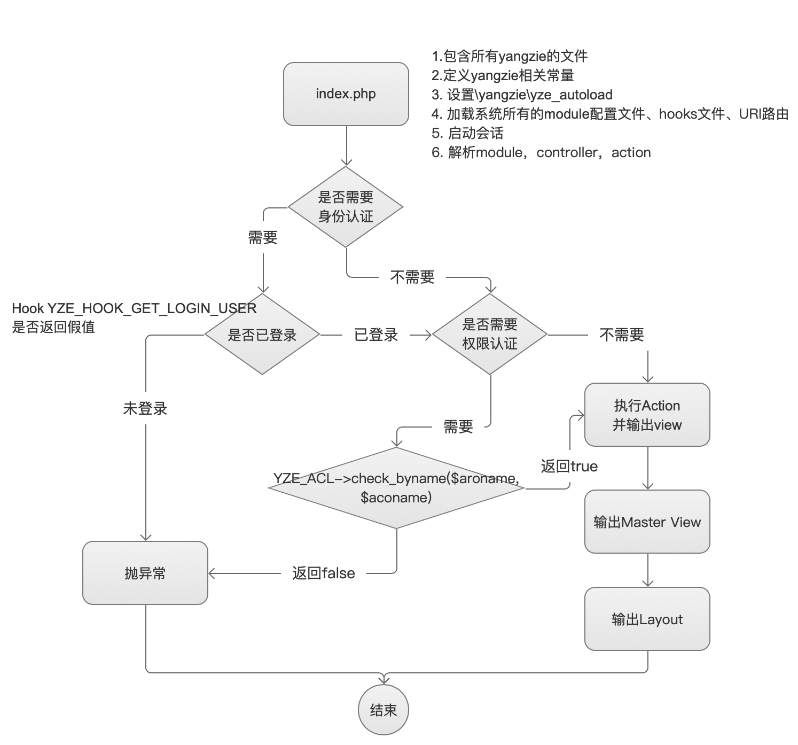

```text
请求进入
  │
  ├─ 是 OPTIONS 请求 ──────────────── 直接放行（不做验证）
  │
  ├─ 通过模块 auths/no_auths 判断是否需要认证
  │     ├─ no_auths 命中（优先级更高）→ 放行
  │     └─ auths 命中（或模块全局 * ）→ 进入认证
  │
  ├─ 调用 Hook YZE_HOOK_GET_LOGIN_USER 获取登录用户
  │     └─ 返回非假 → 已登录；返回假值 → 抛 YZE_Need_Signin_Exception
  │
  ├─ 调用 Hook YZE_HOOK_GET_USER_ARO_NAME 获取用户 ARO 角色名
  │
  ├─ 构造 ACO 名称：/模块名/控制器名/方法名
  │
  └─ YZE_ACL::get_instance()->check_byname($aro, $aco_name)
        └─ 无权限 → 抛 YZE_Permission_Deny_Exception
```

#### 登录角色

认证通过后，框架通过两个 Hook 获取当前用户信息，需要在应用中注册（通常放在 `app/hooks/` 下）：

```php

// 返回当前用户的 ARO 角色名，格式如 /admin、/admin/normal、/consumer
YZE_Hook::add_hook(YZE_HOOK_GET_USER_ARO_NAME, function () {
    $user = YZE_User::get_login_user();
    return $user ? $user->get_role_name() : '';
});
```

#### 静态 ACL 配置

在 `app/__aros_acos__.php` 中定义系统中所有需要鉴权的 ACO，以及黑名单/白名单：

```php
function yze_get_acos_aros() {
    $array = [
        // 根 ACO，默认放行
        "/" => [
            "deny"  => [],      // 黑名单：明确拒绝的 ARO
            "allow" => ["*"],   // 白名单：允许的 ARO
            "desc"  => "",      // 功能说明（用于错误提示）
        ],

        // 具体 ACO：/admin/user 下的所有 action（省略方法名等同于 /admin/user/*）
        "/admin/user" => [
            "deny"  => ["/consumer"],     // 消费者角色禁止访问
            "allow" => ["/admin"],        // 管理员角色允许访问
            "desc"  => "用户管理",
        ],

        // 支持正则的 ACO，如订单相关操作
        "/admin/order/(post_?)add" => [
            "deny"  => [],
            "allow" => ["/admin/super"],
            "desc"  => "创建订单",
        ],
    ];
    return $array;
}
```

配套辅助函数：

```php
// 完全不需要权限控制的 ACO（不走鉴权直接放行），支持正则
function yze_get_ignore_acos() {
    return [
        "/login",
        "/public/.*",
    ];
}

// 返回指定 ACO 的功能描述，用于权限不足时的错误提示
function yze_get_aco_desc($aconame) {
    // 框架已内置实现：匹配 yze_get_acos_aros 中第一个正则命中的 desc
}
```

#### 动态权限

如果权限需要存数据库并动态调整，可定义以下两个函数（定义后框架优先使用，覆盖静态配置）：

```php
// 返回当前登录者的动态权限，格式与 yze_get_acos_aros 中单个 ACO 的 deny/allow 相同
function get_user_permissions() {
    return [
        "deny"  => ["/admin/user/delete"],
        "allow" => ["/admin/user"],
    ];
}

// 返回指定角色的动态权限
function get_permissions($aro_name) {
    return [
        "deny"  => [],
        "allow" => ["/admin/*"],
    ];
}
```

**优先级顺序**（谁先定义了 deny 或 allow，就以谁的结果为准）：

```text
get_user_permissions()  →  get_permissions($aro_name)  →  yze_get_acos_aros() 静态配置
```

#### 权限判定规则

1. **忽略列表优先**：ACO 命中 `yze_get_ignore_acos()`，直接放行（返回 true）。
2. **未配置的 ACO 放行**：ACO 在 `yze_get_acos_aros()` 中无任何匹配时，默认放行。
3. **deny 优先于 allow**：同一 ACO 下同时命中 deny 和 allow 时，deny 生效。
4. **`*` 通配**：deny/allow 中的 `*` 表示全部；ACO 省略方法名（`/admin/user`）等同于 `/admin/user/*`。
5. **父子继承**：ARO 和 ACO 都支持向上一级递归匹配，例如：
   - ARO `/admin/normal` 未命中时，向上递归检查 `/admin`、`/`；
   - ACO `/admin/user/index` 未命中时，向上递归检查 `/admin/user`、`/admin`、`/`。
6. **多角色**：ARO 可以是数组（用户有多个角色），任一角色有权限即放行。
7. **未登录**：抛 `YZE_Need_Signin_Exception`（提示"Please signin"）。
8. **无权限**：抛 `YZE_Permission_Deny_Exception`，提示 `You do not have permission(功能描述:角色名)`，功能描述来自 `yze_get_aco_desc()`。

#### 视图模板中的权限控制

在模板中按 ARO/ACO 控制某段内容的显示（输出缓冲方式）：

```php
<?php $acl = \yangzie\YZE_ACL::get_instance(); ?>
<?php $acl->begin_check_permission($aro_name, "/admin/user/edit"); ?>
    <!-- 只有 /admin/user/edit 有权限的用户才能看到这里 -->
    <a href="/admin/user/edit">编辑</a>
<?php $acl->end_check_permission($aro_name, "/admin/user/edit"); ?>
```

也可以直接用 `check_byname` 判断：

```php
<?php
if (\yangzie\YZE_ACL::get_instance()->check_byname($aro_name, "/admin/user")) {
    // 有权限
}
?>
```

### 第五节 模块打包

Yangzie 支持把每个 module 进行 phar 打包（类似于 jar）。打包后发布时只需发布 phar 包即可，并且 phar 支持 SSL 加密，这样一定程度上可以保护 php 代码。

模块打包需要通过 CLI 进行：运行 `php scripts/yze.php`，然后选择 phar，输入要打包的模块名即可开始打包；如果打包时选择了 SSL 加密，则需要把对应的公钥一并部署到 modules 目录中。

如果看到 disabled by the php.ini setting phar.readonly 的提示，则需要修改 php.ini，把 phar.readonly 设为 0 即可。


### 第六节 模块下public_html的资源访问

模块下的 yze_module_asset_url

## 第四章 控制器

控制器的功能是处理请求，并决定怎么响应请求。控制器主要包含与 URI 对应的 action 方法，以及 public function exception(YZE_RuntimeException $e) 异常处理方法。action 中可以通过 \$this->request 获取请求中的所有内容，它是 YZE_Request 对象，也是一个单例实例，在一个请求的处理进程中是唯一存在的。根据扬子鳄的原则——代码要么成功，要么异常，action 也一样，如果出现任何非预期的问题，都抛出 YZE_FatalException。而 exception 方法就是控制器集中处理自己控制器中的异常的地方，在异常最终反馈给用户前，这里可以给开发者做最后的处理。

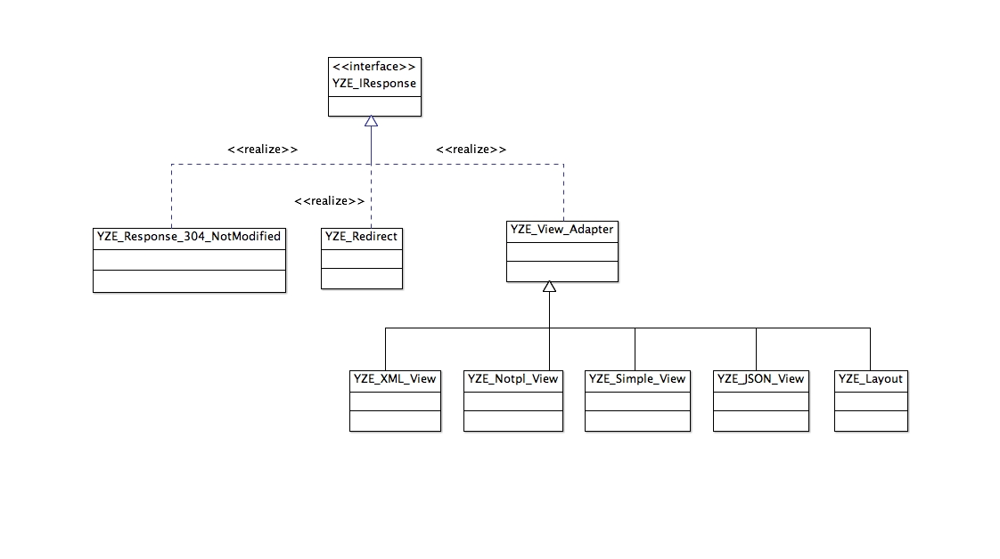

响应主要包含两大类：一类是 HTTP 的状态响应，比如重定向、403、404、304 等；一类是可以看到的视图 View 类，而视图又可以具体地细分为不同格式，比如 XML、JSON、图片、PDF、HTML 等等，这会在后面的视图中详细说明。

我们强烈建议：不要在控制器中输出任何内容，这会破坏框架的响应内容，任何内容都通过"响应"进行返回。

如果要响应视图，每个 action 在 views 中都有一个对应的视图模板文件，比如 Index_Controller::detail 方法对应的 views 模板文件是 index-detail.tpl.php，其中的 tpl 是视图的格式，这在视图中再详细说明。在控制器中，只需通过控制器的 set_view_Data 方法即可给视图传递数据。

默认每个 action 对应一个 view 文件，action 执行完成后框架就会去寻找这个默认的视图文件，但是可以在控制器代码中通过给 `$this->view` 赋值来让 action 响应其他 view 视图：

1. 如果要显示本模块下面的其他 view 视图，那么只需要指定 view 名即可，比如 `$this->view="foobar"`，那么框架便会去寻找 foobar.tpl.php 视图文件，其中 tpl 是默认的视图格式。如果请求指定了视图格式后缀，比如 /orders/1234.json，那么通过上面的设置后，框架会去寻找 foobar.json.php 视图文件。某些情况下，action 不需要返回复杂的视图或者需要返回简单的 xml 或者 json 结构体，这个时候就需要在 action 方法中明确的 return 一个 view 了：`return new YZE_Simple_View ( $view_path, $view_data, $this, $format )`，返回一个指定的 view，比如一个公共的视图文件。view_path 就是一个具体的视图文件路径，不需要后缀部分；view_data 是一个传入 view 的 key=>value 数组数据；`$this` 是传入到 view 中的控制器，在视图中可以通过 `$this->controller`获得`$format` 是视图的格式，默认是 tpl，它会和 view_path 组合从而找到正确的 view 路径，可通过 `$request->get_output_format()` 获取
2. YZE_XML_View 把你的数据按照 XML 结构返回
3. YZE_JSON_View 把你的数据按照 JSON 结构体返回
4. YZE_NoTpl_View 直接返回 string

同一个 url 根据 HTTP 的请求方法不同，action 也会不同。比如修改订单的地址 /orders/12345/edit，映射的 action 是 Order_Controller::edit；那么用户在访问这个地址时，是通过 GET 请求访问的，对应执行的 action 就是 Order_Controller::edit。但是当用户在该界面进行数据提交后，HTTP 就是通过 POST 方法提交请求的，为了区分这两者请求，POST 将会映射到 Order_Controller::post_edit。前者用于返回视图展示，带 post_ 开头的方法主要用于处理数据提交，两者是同一个 URI 的两种 HTTP 请求方法，进入两个不同的 action。

### Post 方法的返回

按照框架的约定，controller 的 action 必定会返回一个 Response 响应。在 RESTful 规范中 post 通常表示对资源的创建，post 方法的返回取决于用 Yangzie 框架做的是现代的前后端分离的后端代码，还是传统的未前后端分离的 web 系统。

### 传统的 web 系统

这时在 post 方法中，可以什么都不用 return，那么扬子鳄默认会重定向到对应的 URI。最终效果就是用户提交表单后页面会刷新（会产生两次 URI 请求：一次 post 提交，一次是 get 重现界面）。

如果开发者需要回显界面但又不需要界面刷新，这需要通过 `$this->view` 来设置，设置为具体的 view，那么 post 处理完成后就会返回这个 view 视图界面（只会产生一次请求，post 后便返回设置的 view）；或者 post 的处理过程中出现了错误而抛出了异常，Yangzie 也会重新展示 view。

但要注意，这时其实是在 post 的请求中返回界面，如果此时浏览器刷新，浏览器会提示表单会被重复提交。

### 前后端分离

这时 Yangzie 完全做的是后端接口，不需要处理界面，post 方法中只需要返回对应的接口结构即可，比如：

```php
return YZE_JSON_View::success($this, $data);
```

### exception 异常处理

该方法是控制器在进行流程处理过程中出现异常后，进行集中处理的地方，这跟用 Yangzie 做纯后端，还是传统前后端混杂有区别，默认的处理如下：

```php
public function exception(\Exception $e){
    $request = $this->request;
    $this->layout = 'error';
    //Post *请求或者返回*json*接口时，出错返回*json*错误结果
    $format = $request->get_output_format();
    if (!$request->is_get() || strcasecmp ( $format, "json" )==0){
        $this->layout = '';
        return YZE_JSON_View::error($this, $e->getMessage());
    }
}
```

开发者自行根据自身情况决定异常错误怎么返回给前端。

### 控制器的最佳实践

1. 控制器里面不要进行任何形式的输出
2. 控制器中的逻辑处理，要么成功，要么就抛出异常
3. 控制器中的逻辑代码采用四段式：获取数据，数据验证，逻辑处理，返回响应
4. 在 exception 方法对异常做最后的处理

## 第五章 视图


视图View是一种"**响应**"类型，是用户能够看得到的响应。对于 Web 应用，一个请求响应的视图基本上就是一个 HTML 界面。在 Yangzie 框架中，每种视图都有一个"**格式**"，默认的视图格式是 `tpl`。某个请求对应的 action 都有一个默认的 view 存在于 views 目录中，默认视图文件名是 [控制器名]-[action名].tpl.php，其中 `tpl` 就是视图的格式。

视图格式是扬子鳄的一大特色。扬子鳄允许开发者自由地定义各种格式，从而让同样的请求得到不同的响应结果。比如一个订单详情的 URI 是 /orders/[订单ID]，默认视图是 `order-detail.tpl.php`，返回 HTML 结果；但如果开发者想把订单详情导出成 PDF，只需要访问 /orders/[订单ID].pdf，然后增加一个 `order-detail.pdf.php` 视图，在该视图中处理输出 pdf 的即可；你还可以提供一个 json 接口：/orders/[订单ID].json，等等。

> 增加视图要做的工作只有一个：**增加对应的视图格式文件，并在其中进行格式输出即可**。

扬子鳄在所有使用视图的地方都只需要提供视图的名字，也就是 `order-detail.tpl.php` 中的 `order-detail` 部分。扬子鳄会根据请求的上下文推断视图的格式，从而正确地包含对应的视图格式文件，但如果对应的视图格式文件不存在的话，默认会包含 tpl 格式的文件。

扬子鳄的视图本质就是传入数据，然后进行输出。对于 tpl 格式的输出，视图文件就是"传统"的 php 模版文件，混杂着 php 代码和 html 等代码。扬子鳄建议视图只负责输出，不处理复杂的业务逻辑；业务逻辑都放在业务对象（Model）或者在控制器中进行处理，视图就处理输出就行了。

视图文件本身是一个独立的文件，在其中的代码可以通过 `$this` 引用到视图对象自己，并调用其中的各种方法。最常用的方法便是通过 `$this->get_data("name")` 获取控制器传递过来的数据，或者通过 `$this->controller` 引用到上下文控制器。

### 第一节 视图组件

重用是开发者极力追求的目标，扬子鳄对视图提供了简单易用的重用支持。因为在扬子鳄的框架里，视图本身就是以组件形式存在的，有三种方式重用视图：一）简单的文件包含，这类似于传统的 include；二）继承 YZE_View_Component，通过 OOP 的方式实现重用；三）master view 和 layout。

#### 方式一、简单的文件包含

如果知道文件的路径，可以直接用传统的 include 使用视图。同目录的视图复用才建议这么做，跨模块视图用这种方式重用会导致维护困难；并且include方式无法自动处理格式问题，对于一个系统级别重用的组件，扬子鳄建议把重用的组件放在 app/vendor/views 中，这种情况下就需要用到 `YZE_Simple_View` 类了，用法如下：

```php
$view = new YZE_Simple_View(YZE_APP_VIEWS_INC."视图名字", $data, $controller, $format=null);
$view->output();
```

其中的 data 是传入视图的数组结构。对于放在其他地方的视图组件，根据第一个参数只要能正确引用到视图文件即可；调用 output 即可输出视图的内容。但如果只需要得到输出的结果，不需要实际输出到客户端的，那么可以通过 get_output() 得到视图的结果。
`YZE_Simple_View` 是对直接 include 的方式的封装，对于作为组件的视图本身不需要改变什么。如果一个模块的视图作为组件，只需要把组件拷贝到 vendor/views 中即可（不拷贝也可以用，第一个参数指向正确的视图目录即可）。`YZE_Simple_View` 便能直观地传入数据；最后一个参数是视图的格式，扬子鳄会根据请求的上下文自动判断视图组件的格式，从而包含具体的视图文件。如果开发者要固定视图格式，可以主动传入。

这种包含组件的方式很方便，视图组件可以按照最"传统"的 php 方式编写并被包含。但这种方式的弊端是使用者无法直观地知道视图组件需要传入什么内容（无法利用代码提示），需要进入视图组件查看或实现约定。

#### 方式二、YZE_View_Component

为了解决 YZE_Simple_View 的弊端，可以通过把组件定义成一个继承自 `YZE_View_Component` 的 Class，这是一种完全 OOP 的方式，那么使用者便可以通过该 class 的方法明确地知道视图组件解决什么问题、传入什么数据。

组件类的构造函数传入两个参数 `YZE_View_Component($data, $controller)`：前者是传入给组件的数据，后者是上下文控制器。组件必须要实现的方法是 output_component()，其作用是负责组件具体的输出；这样组件在被调用 output() 或者 get_output() 的时候就会调用该方法。

视图组件可以放在模块的 views 中，也可以放在 vendor/views 等任何地方，只需要 namespace 和路径一致即可（见命名约定）。视图组件不需要手工 include 其文件，扬子鳄框架通过 autoload 的方式自动加载被使用的组件，但需要 `YZE_View_Component` 的组件文件名按照固定的格式进行命名文件和命名类：

1. 组件名：[组件名]_View；这里的组件名按驼峰命名法，首字母大写，下划线分割单词。
2. 组件文件名：[组件名].view.php，这里的组件名全部小写。

比如组件 Foo_Bar_View，其文件名就是 foo_bar.view.php。

这种方式的好处是用 OOP 的方式来进行组件的重用，开发者可以对组件提供更多的处理方式；但对视图格式的支持，需要组件在 output_component 中自行判断处理。

#### 方式三、master view 和 layout

根据 HTML 文档结构的特点，界面 HTML 元素之间有包含关系，但方式一和方式二定义的组件只能在使用者内部的某一个指定位置输出，不能输出在使用者内部的多个位置，也就是只能输出下面的结构：

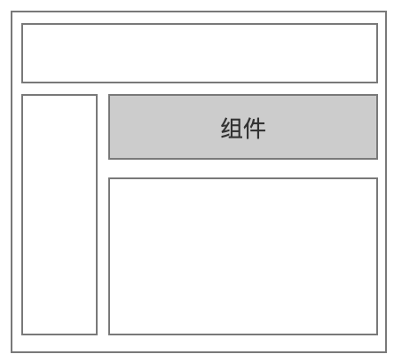

但某些情况下，需要由视图组件控制界面多个地方的输出。比如每个页面都会显示的顶部菜单或者边栏菜单，需要根据视图组件的不同，来更新这些内容，比如下面这种情况：

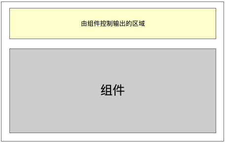
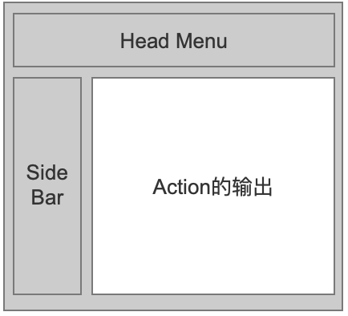

那么就需要用到 layout 或 master view，前者主要处理整个页面的布局定义，后者主要处理复杂的ui嵌套。

### 第二节 Layout 布局与资源绑定

一个系统虽然功能界面各不相同，但是页面上的某些部分在很多页面甚至是所有页面都是相同的，比如顶部的菜单、左边的边栏菜单。这些相同部分的处理，我们不可能在每个 action 的视图中都重复。如下图所示，action 只负责输出该 url 访问的重点内容，其他共性的部分就可以通过 Layout 来重用。Layout 是一个特殊的视图组件，它负责输出公共的视图界面和 HTML 的整体文档结构，也就是 html、head、body、CSS、JS 等等：

下面的代码是 tpl 格式的 Layout 内容：

```php
<?php
namespace yangzie;
?>
<html>
<head>
<meta charset="utf-8">
<title><?php echo $this->get_data("yze_page_title")?> － <?php echo APPLICATION_NAME?></title>
<?php
yze_css_bundle("bootstrap");
yze_module_css_bundle();
yze_js_bundle("jquery,bootstrap,yangzie,pjax");
?>
</head>
<body>
    // 全局菜单
    <?php echo $this->content_of_view();?> // action的输出内容
    <?php yze_module_js_bundle();?>
    // 全局的页脚展示
</body>
</html>
```

其中 `<?php echo $this->content_of_view();?>` 就是控制器 action 的视图要输出的地方。layout 视图组件是一个单独的视图文件，固定放置在 app/vendor/layout 中，按照如下格式进行命名：`[视图格式].layout.php`。比如默认格式的就是 `tpl.layout.php`，当请求 json 时就是 `json.layout.php`。layout 定义好结构，在具体输出的地方调用 `<?php echo $this->content_of_view();?>` 即可。

对于移动设备，扬子鳄支持独立的布局，只需要创建一个 `[视图格式].moblayout.php` 的文件即可，其他和 layout.php 完全一样；如果没有该文件，默认也是使用 layout.php 输出。

也可以手动指定 layout，在 controller 中或者在 view 中通过 `$this->layout="布局名"` 来指定布局，布局名就是 `tpl.layout.php` 中的 tpl。被指定的布局需要在 app/vendor/layout 中存在，开发者可以根据实际情况定义不同的布局效果，比如按角色区分，然后根据身份切换布局。如果设置 `$this->layout=""`，那么请求访问的结果就是直接输出 action 的内容。

#### 资源绑定及输出

对于网页，除了处理 html 结构外，还需要处理 css、js 等资源的引用。在扬子鳄中可以通过资源绑定的方式把 css、js 进行按组打包加载，避免请求资源文件的 http 请求过多，并且能充分利用 http 的缓存机制避免资源的重复下载。相同的资源项通过"组"的方式进行绑定。由于前端加载 css 和 js 的方式不同，"组"分 css 和 js 两种类型，比如说 bootstrap 的 js 资源组，可能就包含了 jquery.js、bootstrap.min.js 等；bootstrap 的 css 资源组，可能就包含了 bootstrap.min.css 等。归组后当加载 bootstrap 组时，系统会自动打包组内的所有 js 文件，在一个请求中完成加载，并提供基于 http 的缓存机制。

要实现资源文件打包输出，首先需要在 app/\_\_config\_\_.php 中定义自己系统所有的资源。js_bundle 和 css_bundle 函数分别返回对应的资源数组结构：key 是资源组名，value 是一个数组，包含了该组的所有资源文件。资源文件引用的路径都是以 public_html 作为起始的，并且以 / 开头，通过前面介绍的虚拟域名可知，/ 就是网站的根目录。

举例：

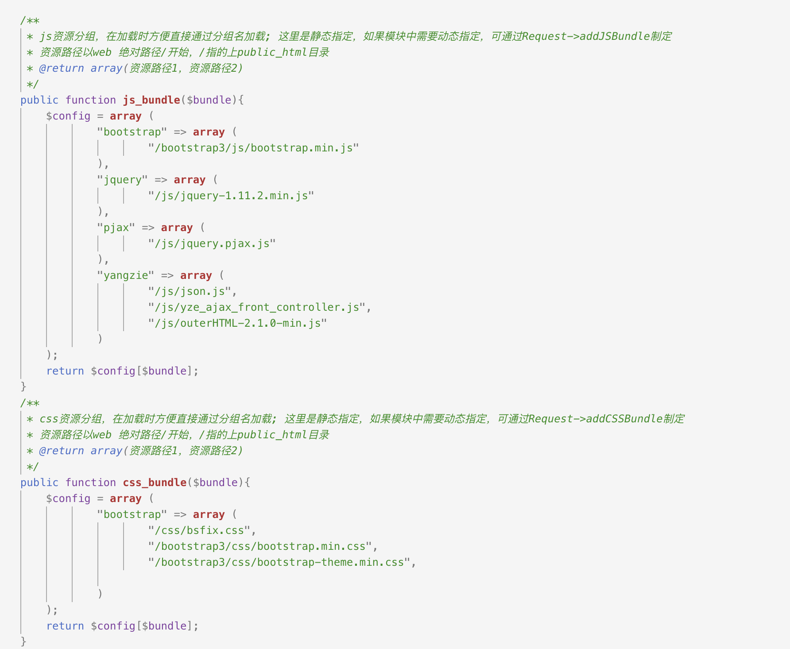

在布局或者其他视图中就可以通过 `<?php yze_css_bundle("bootstrap");?>` 输出 bootstrap 组的 css 文件，`<?php yze_js_bundle("jquery,bootstrap,yangzie,pjax");?>` 就输出 jquery、bootstrap、yangzie、pjax 这四个组的 js 文件。

在每次请求这些资源文件时，Yangzie 会基于 HTTP 的缓存机制判断文件是否有更新：如果没有更新，则返回 304 Not Modified 状态，并不会实际返回文件内容；如果有文件更新了，才会返回所有的文件内容。如果需要强制刷新，可以传入第二个参数，比如在系统某次更新后，更新系统的版本后，把版本号作为第二个参数传入，那么系统发布后用户访问时，就会第一时间刷新相关的缓存资源。

上面的资源绑定是整个系统的资源文件。某些情况下，某个模块可能有自己独有的资源文件，这时可以通过 `<?php yze_module_css_bundle();?>`,`<?php yze_module_js_bundle();?>` 输出当前请求处理模块的资源文件，也就是模块里面的 public_html/ 下的资源文件。同样需要在模块的 \_\_config\_\_.php 的 js_bundle 和 css_bundle 函数进行处理，方式同 app/\_\_config\_\_.php。

#### PJAX 支持

扬子鳄原生支持 PJAX。通过 PJAX 访问时（在 HTTP 头加入 HTTP_X_PJAX 头部信息），不使用布局，因为 PJAX 局部刷新只需要 action 的响应，页面主体结构已经加载完了，PJAX只需要刷新action的输出部分即可。
要在yangzie中使用PJAX，只需要引入相关的PJAX库即可。PJAX属于前端功能逻辑，yangzie对于PJAX请求会自动处理，只返回action部分的响应，至于PJAX要局部刷新页面的那一部分，请查阅具体的PJAX库文档

#### yze_page_title

Layout 也是 view，所以 controller 中通过 set_view_data() 设置的数据，在 layout 也同样可以通过 get_data 获取。设置的数据名是开发者自定义的，但 yze_page_title 是系统保留数据名，用来指定页面的 title。

#### 多个部分的输出

正常情况下，组件的输出只会出现在一个地方，但某些情况下，组件需要改变界面多个地方的输出，比如下图所示的界面布局：

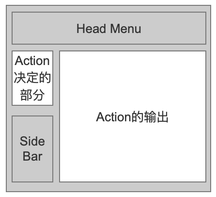

"Action 的输出"这部分是当前 URL 请求的主要内容，其余部分是整体界面框架布局。但是"Action 决定的部分"也是需要根据 Action 来改变的：访问 `foo/bar` 和访问 `foo/anotherbar` 需要在"Action 决定的部分"展示不同的内容。那么这种情况，这部分的输出就应该交给 action 组件来处理，这时就出现了一个组件在界面上不同的地方有输出内容的情况。Yangzie 框架采用 section 来实现这一点："Action 的输出"是组件的主体输出部分，而其他的输出我们通过定义一个 section，组件往 section 中放内容，而使用者则在需要的地方从 section 中取内容输出即可。这一部分在 Section 中单独介绍。

### 第三节 Master View

Master View 与 Layout 一样，都是能处理界面嵌套的组件。区别是 Layout 只能用一个，也就是一次请求的响应中只会有一个 Layout，能放到 Layout 里面的基本都是系统重复率非常高的内容。但某些情况下，一些界面内容可能只在某个模块下面会重复，比如下面几种情况：

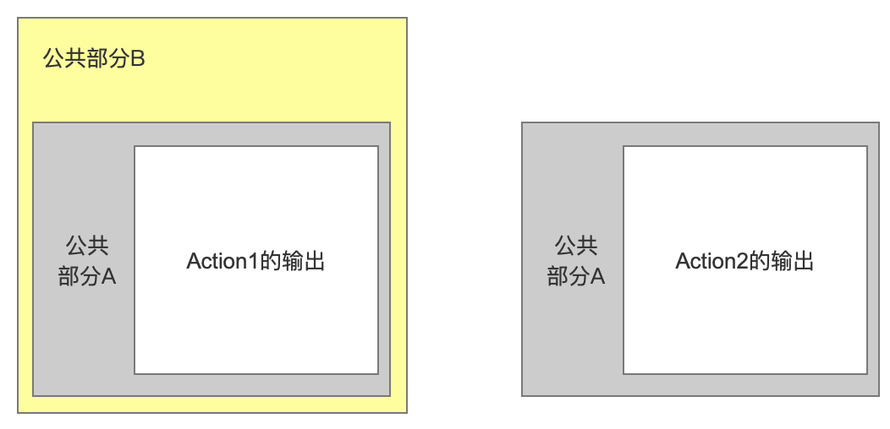

- Action1 和 Action2 两个 URI 请求的响应中都有相同的界面部分"公共部分A"，并且响应都是被包含在"公共部分A"里面的
- Action1+公共部分A 的输出又被包含在公共部分B 中

要处理上面的界面重用，可以用 Layout，相当于做两个 Layout：公共部分`A.layout.php` 和公共部分`A+B.layout.php`，也可以用 Master View。

Master View 可以放在任何地方，可以是 tpl.php 类型的文件，也可以是 YZE_View_Component 组件。比如如果只是某个模块重用，这只需放在模块的 views 中即可；如果是项目重用的，可以放在 `app/vendor/views` 中。放置的位置不一样只是用的时候引用的地址不一样而已。Master View 文件命名和 View 是一样的：[Master View 名字].[视图格式].php，文件的写法也一样，只是作为容器 Master View 需要跟 layout 一样，在需要在输出的地方调用 `<?php echo $this->content_of_view();?>`。

要使用 Master View 只需在 View 中给 `$this->master_view` 赋值，比如 `$this->master_view = "master/project-leftmenu"`。扬子鳄框架在输出响应时，就会先寻找当前模块的 views 中是否存在`master/project-leftmenu` 文件，如果不存在则寻找 `app/vendor/views` 中是否有，如果都没有找到则抛出异常。赋值的文件只包含名字即可，框架会按照当前的请求格式自动寻找对应的 php 文件，比如 project-leftmenu.tpl.php。

Master View 也是 view，也可以再次指定 master view，比如上图中的 Master View "公共部分A"可以再次指定自己的 master view 是"公共部分B"，从而实现复杂的重用的界面嵌套。

### 第四节 Section

上面我们介绍了有嵌套的 View 的组件和一般的组件，但是还有一种复杂的互相交错的界面方式。比如在输出 Layout 或者 Master View 的时候，除了要把 Action 的响应放在指定的地方输出外，可能界面上其他地方的输出也需要由 Action 来指定，比如下面的情况：


其中"Action 决定的部分"是由 Layout 或者 Master view 决定输出位置，但具体的输出内容由请求 URI 的 Action 负责。比如访问 /users/[用户id] 时这里放关于用户的内容，但是当访问 /orders/[订单id] 时这里放关于订单的内容。

一个 Action 需要输出多个内容在界面的不同的地方，这时就可以通过 Section 来实现。用法是在 View 中定义 Section，然后在容器（Layout 或者 Master）中输出即可：

1. View 中定义 Section，使用了 PHP 的缓存机制，用 `$this->begin_section()` 表示开始定义 Section 的输出内容，用 `$this->end_section($section_name)` 来结束 Section 的定义。
2. 容器中输出 Section，只需要通过 `echo $this->content_of_section($section_name)`。`$section_name` 就是 View 中 end_section 指定的名称。

### 第五节 响应格式

扬子鳄对于响应内容，提供了"响应格式"的特性。响应格式就是用户期望一个请求应该返回什么样的内容，比如返回网页、图片、PDF 等。要支持响应格式，对扬子鳄框架来说非常简单：从上面的介绍已经知道，每个 Action 的响应对应一个独立的视图文件，并且文件的名字上已经包含了响应格式。比如 order-detail.**tpl**.php。那如果同样的请求，用户需要导出 PDF 或者 XLS，则只需要在访问的 URI 加上需要的格式后缀，比如 /orders/12345.pdf，然后对应地增加一个 order-detail.pdf.php 文件，并在该视图文件中做 pdf 的输出处理。这样访问 URI 时就会输出 pdf 格式的视图文件。当然，在对应的视图文件中，开发者需要自行处理对应格式如何才能正确输出。

响应格式让控制器做到重用：当同样的请求需要得到不同的结果时，开发者只需要处理对应的视图即可。如果开发者需要，可以通过 `$request->get_output_format()` 得到当前请求的响应格式。

在某个响应格式的视图输出中，如果又通过 YZE_Simple_View 或者 Master View 引用其他的 View 组件，框架会自动寻找这些组件对应的输出格式。比如输出 PDF 时如果用到了 A 视图组件，那么扬子鳄会使用 A.pdf.php 的版本。这里需要注意的是，如果对应版本的视图文件不存在，默认还是会使用 tpl.php 视图。

#### 移动设备的支持

虽然前端的组件都支持各种设备屏幕的自适应，但它们的实现方式都是通过 media 查询，根据不同的屏幕尺寸对界面上的元素进行相关的隐藏处理。对应简单的展示页面，这是一个简单有效的办法；但如果是复杂的管理应用，界面上有很多的 Table、Grid 的内容，隐藏并不能很好地展示界面；同时把内容都通过网络流量加载到前端，然后再把部分内容进行隐藏，也显得非常低效。

扬子鳄提倡前端需要什么内容就显示什么内容。既然移动端无法展示更完整的内容，那么就应该只返回适合移动端的内容。扬子鳄的做法是提供一个默认的移动设备响应格式：mob。
tpl 是 PC 端默认的响应格式，mob 是移动端默认的显示格式。当通过移动设备访问时，扬子鳄会默认去寻找 `[视图组件名].mob.php` 的视图文件和 `[响应格式].moblayout.php` 的布局，开发者只需要创建这些视图文件并根据移动设备的特点开发界面即可；如果没有这些视图文件，那么扬子鳄会输出 tpl 格式的视图。

### 第六节 错误页面

当发生异常时，扬子鳄使用 error 布局显示错误页面，并会根据异常的错误状态码，包含 `vendor/views/[错误码].[视图格式].php` 的视图显示错误。开发者如果要自定义错误页面，那么这些文件是开发者定制错误页面的地方。

### 视图最佳实践

1. 不要在视图中做任何的业务逻辑处理，比如数据库查询，提交，视图就负责输出数据；把这些业务逻辑放到Controller或者Model中

## 第六章 数据库处理

CLI: php scripts/yze.php --model -d=数据库名 -t=表名 -M=模块名。
需要事先在 app/\_\_config\_\_.php 中配置好数据库连接信息。

说明：Yangzie 的数据库处理基于 PDO，并且各项功能只在 MySQL 上进行了测试。

扬子鳄对数据库的操作提供了 YZE_Model 类、YZE_DBAImpl 连接操作类和 YZE_SQL SQL操作类。数据库的操作有三种方式：

一）采用 Model 直接操作
二）通过 YZE_SQL 类 + YZE_DBAImpl
三）原生 SQL 语句 + YZE_DBAImpl

### 第一节 Model 类

在介绍 model 之前需要说明一下 Yangzie 对 model 的一些约定：

1. 每个表必须有一个且只有一个自增的主键字段。
2. 需要有一个 uuid 字段（生成 model 时可通过 `--uuid` 参数指定，默认字段名为 `uuid`）

Model 类是对数据库表的映射，database to code 的方式，需要事先创建好数据库表，再通过 scripts/yze.php 生成。每个表映射会生成两个文件：`[数据库表名].model.php` 和 `[数据库表名].method.php`。前者是表的映射信息，该文件由框架维护，开发者不要进行修改；后者提供给开发者编写 model 相关的业务方法。

#### [数据库表名].model.php

生成的 model 类的名称是 [数据库表名]_Model，并继承自 YZE_Model，映射的内容包含：

1. 每个 enum 字段会额外生成一个独立的 PHP enum 类型文件（类型名 `[模型名]_[字段名]_Enum`，文件名为小写），case 名与值均为 MySQL enum 值；生成代码中不再定义 `[字段名称]_[enum值]` 类常量，取枚举值直接使用生成的 enum 类型的 `cases()`
2. 所有的表字段声明为带 `#[Column(...)]` 属性注解的私有属性，框架通过反射读取注解生成字段配置，格式如下：

    ```php
    #[Column(type: 'string', nullable: false, length: 45, default: '')]
    private string $name;
    ```

    Column 注解参数说明：

    | 参数 | 说明 |
    |---|---|
    | `type` | 字段数据类型：int，float，string，date，enum |
    | `nullable` | 是否允许为 null：true/false |
    | `length` | string、int 等的长度，0 表示无限制 |
    | `default` | 默认值 |
    | `encrypt` | 字段是否加密存储（见字段加密） |

3. 表常量：`TABLE`（表名）、`MODULE_NAME`（模块名）、`KEY_NAME`（主键字段名）、`UUID_NAME`（uuid 字段名）
4. `unique_key`：唯一键字段映射（字段名 => 键名）；`relation_column`：外键关联映射
5. 如果表和其他表之间有关联关系，会自动生成相关的 get、set 函数，方法名就是关联字段名去掉_id的部分
6. 加密字段设置：字段可通过 Column 注解 `encrypt: true` 声明为加密字段（旧模型也可在类中定义 `$encrypt_columns` 数组），见字段加密

#### [数据库表名].method.php

该文件采用 PHP trait 的方式，让开发者编写自定义的业务方法，默认 trait 中有如下几个方法：

1. get_column_mean：返回字段的含义，生成的 model 默认会返回数据库字段注释（没有注释时返回字段名），未生成该方法时基类默认返回字段名
2. get_description：返回表描述
3. is_enable_graphql、custom_graphql_fields、query_graphql_fields 是 GraphQL 相关字段，在 GraphQL 章节中说明

#### Model 查询数据

Model Query 是对 SQL 和 YZE_DBAImpl 的封装，不需要开发者按照 SQL 那种严格的格式写 SQL 语句，不用担心 SQL 注入，不用管理数据库连接，让开发者能灵活地根据情况拼接查询语句。它的语法如下：

```php
Model::from($alias)->Where Statement->Execute Statement();
```

**Model::from()** 是查询的开头，要查询什么表，就用该表的 Model，比如要查 user 表，那么就是 User_Model::from()。如果单表查询，可以不用传入 alias。
**Where Statement** 部分是条件查询或联合语句部分。条件查询通过 `where($whereStatement)` 实现，与 SQL 中的 where 部分一样，但不需要硬拼接变量条件：不要写成 `where("column='{$val}'")`，而应该写成占位符形式 `where("column=:column")`，在执行部分指定参数，交给框架处理，避免 SQL 注入。可以在一个 where 中写入全部条件：`where("a.column=:a or date_format(b.column,'%Y%m%d')=:b")`。如果 where 调用多次，它们之间需要明确指定是 and 还是 or：`->where("a.column=:a")->where("or date_format(b.column,'%Y%m%d')=:b")`。

提供了如下几种联合查询方法：

1. join(Other_Model_Class, Other_Model_alias, Join_On_Case, $suffix)
2. left_join(Other_Model_Class, Other_Model_alias, Join_On_Case, $suffix)
3. right_join(Other_Model_Class, Other_Model_alias, Join_On_Case, $suffix)

**Execute Statement** 部分就是指定查询方法和传入查询参数，查询方法有：

1. `select($params, $alias)`：查询指定 alias 的一组数据。$params 就是指定 where 或者 join on 中的占位符及其值，是一个数组，key 是占位符，value 就是值，比如 `[":column"=>123]`。Alias 如果不指定，则查询出所有数据，每行包含了所有的 model 数据，并以 alias 作为 model 的 key、model 对象作为 value；如果联合查询的 model 并没有查询出结果，则 value 是 null。例如：

    ```php
    [
    [
        'u'=>UserModel1,
        'r'=>RoleModel1
    ]
    [
        'u'=>UserModel2,
        'r'=>RoleModel2
    ]
    ]
    ```

    如果指定了 alias，则查询指定表的数据，这时每行就是一个 model 对象，例如：

    ```php
    [
    UserModel1
    UserModel2
    ]
    ```

2. `get_Single($params, $alias)`：参数用法同 select，但这时的结果只返回一条。单表查询时返回的就是一个 Model 对象；如果是多表联合查询，Alias 如果不指定，则返回一个数组，每个数组 value 就是一个 model 对象，key 是对应的别名；如果联合查询的 model 并没有查询出结果，则 value 是 null。例如：

    ```php
    [
        'u'=>UserModel1,
        'r'=>RoleModel1
    ]
    ```

    如果指定了 alias，则查询指定表的数据，这时就返回指定的 model 对象。
3. `count($field, $params, $alias, $distinct)`：field 为要计数的字段，params 和 alias 同上，distinct 表示是否去重
4. `sum($field, $params, $alias)`：field 为要合计的字段，params 和 alias 同上
5. `max($field, $params, $alias)`：field 为要取最大值的字段，params 和 alias 同上
6. `min($field, $params, $alias)`：field 为取最小值的字段，params 和 alias 同上

其他聚合函数：

1. `limit($start, $limit)`：分页
2. `order_by($column, $sort, $alias)`：排序
3. `group_by($column, $alias)`：分组

Model 查询必须以 ::From() 开始、以 Execute Statement 结束，中间的条件和联合可任意顺序调用，支持链式调用，比如：

```php
$query = User_Model::from('u')->where($where)->left_join(Order_Model::class, 'o','o.user_id=u.id');
if ($condition){
    $query->left_join(Foo_Model::class, 'f','f.id=u.foo_id');
}
```

#### Model 保存数据

要保存数据只需要调用 Model 的 save 方法。调用 model 的 set 方法给字段赋值后，调用 save，框架会根据 model 的主键判断是执行 insert 还是 update：如果设置了主键字段的值则 update，否则 insert。

> 注意：当前版本 model 的 save 更新分支（主键已有值时）存在缺陷，会生成错误的 SQL，暂不可用；有主键的更新请改用原生 `update()`（见第四节）或 `YZE_SQL::update() + execute`。插入（无主键）与下述各保存策略不受影响。

```php
save($type=YZE_SQL::INSERT_NORMAL, YZE_SQL $checkSql=null)
```

Yangzie 支持按条件保存，这通过 save 的第一个参数来指定，分别有如下几种情况：

1. `INSERT_NORMAL`：默认插入语句
2. `INSERT_NOT_EXIST`：指定的 `$checkSql` 条件查询不出数据时才插入。如果插入、更新成功，会返回主键值；如果插入失败会返回 0，这时的 `$entity->get_key()` 返回 0
3. `INSERT_NOT_EXIST_OR_UPDATE`：指定的 `$checkSql` 条件查询不出数据时才插入，查询出数据则更新这条数据。如果插入、更新成功，会返回主键值；如果插入失败会返回 0，这时的 `$entity->get_key()` 返回 0
4. `INSERT_EXIST`：指定的 `$checkSql` 条件查询出数据时才插入。如果插入、更新成功，会返回主键值；如果插入失败会返回 0，这时的 `$entity->get_key()` 返回 0
5. `INSERT_ON_DUPLICATE_KEY_UPDATE`：有唯一键冲突时更新其它字段，这时不用传入 checkSQL，框架会用 model 的字段值生成 `ON DUPLICATE KEY UPDATE` 语句（冲突键由数据库唯一索引判断）
6. `INSERT_ON_DUPLICATE_KEY_REPLACE`：有唯一键冲突时先删除原来的，然后再插入
7. `INSERT_ON_DUPLICATE_KEY_IGNORE`：有唯一键冲突时忽略，不抛异常

`$checkSql` 为要检查的 sql，写法见后面的 SQL 类。

#### Model 删除数据

删除某条数据，可以调用 model 的 `remove` 对象方法；如果要批量删除数据，可以调用静态方法 `delete($params, $alias)`，删除满足条件的记录，params 和 alias 同上；如果要清空所有数据，可以调用 `truncate` 方法。

> 注意：`remove` 对象方法当前存在缺陷（依赖的底层删除接口暂不可用），删除单条记录请改用原生 `deletefrom()`（见第四节）或先查询出主键再按主键删除。

#### Model 其他方法

1. `find_by_id` 根据主键查找一条数据（当前存在缺陷，暂不可用，请改用 `YZE_SQL + get_Single` 查询）
2. `find_by_ids` 根据多个主键查找一组数据（当前存在缺陷，暂不可用，请改用 `YZE_SQL where ... IN ... + select` 查询）
3. `from_Array` 根据数组创建对象
4. `from_Json` 根据 json 对象字符串创建对象
5. `Get/set` 设置对象的字段值，也可以直接调用 `$model->field` 或者 `$model->field=""` 赋值
6. `insert_Or_Update` 对 `INSERT_NOT_EXIST_OR_UPDATE` 的封装：对传入的一组字段进行判断，如果这些字段的值在数据库中找不到则插入，否则更新（当前存在缺陷，暂不可用）
7. `Update_by_id($id, $attrs, $db, $suffix)` 根据主键更新一条数据（当前存在缺陷，暂不可用，请改用原生 `update()`）
8. `save_from_data($posts, $prefix, $type, $checkSql)` 助手方法，把 post 的数据赋值给 model，再调用 save 方法
9. `find_by_uuid` / `find_all` / `remove_all` 等辅助方法：`find_all` 查询全部、`remove_all` 清空全部可用；`find_by_uuid` 当前存在缺陷

### 第二节 SQL 类

`YZE_SQL` 类的主要职能是对原生 SQL 的封装，编写灵活，摆脱了原生 SQL 严格的书写顺序和不同 SQL 方言之间的差异。通过使用 `YZE_SQL` 可以采用统一的写法，支持不同的数据库 SQL 方言。`YZE_SQL` 是采用 OOP 的方式，把 SQL 的各个元素封装成具体的方法，具体使用步骤是：

1. 创建一个 `YZE_SQL` 对象：`$sql = new YZE_SQL()`;
2. 跟 SQL 语法一样，指定要操作的表：`$sql->from("表对应的Model的Class name", "别名")`。如果是单表查询，别名不用指定；如果是多表查询，则必须指定：`$sql->from("主表的Class Name", "主表别名")->left_join("联合查询的表class name", "别名", "联合查询的on条件")`
3. 通过 `where($whereStatement)` 拼接查询条件，写法同 Model 的 where（原生条件字符串 + 命名占位符），多条件时以 `or ` 前缀区分：`->where("a.column=:a")->where("or b.column=:b")`
4. 指定 SQL 要做的操作：`select`、`update`、`delete`、`insert`

`YZE_SQL` 只是负责封装并生成 SQL，该 SQL 必须得由 `YZE_DBAImpl` 类执行。

注意，同一个 `YZE_SQL` 实例请谨慎重复使用。如果要重复使用进行不同的查询，可通过下列 API 把相关的内容清除掉，避免上一次解析的 SQL 出现脏数据：

1. `clean()`：清除所有的内容，这相当于得到了一个新的实例
2. `clean_groupby()`：清除掉 group by 部分
3. `clean_limit()`：清除掉 limit 部分
4. `clean_select()`：清除掉 select 的内容
5. `clean_where($alias, $column)`：清空 where 条件
   1. 如果指定了 alias 和 column，则只清空指定的字段条件
   2. 如果指定了 alias 而没有指定 column，则清空指定表的所有字段条件
   3. 如果没有指定任何参数，则删除所有的 where 条件

YZE_SQL 的各方法之间可以任意根据情况组合调用，顺序不限制。

#### SQL 查询数据

构建好 YZE_SQL 对象后，就可以通过 select 查询方法查询指定的对象。
`select($alias, $select)` 要查询的表别名和要查询的字段。如果不调用该方法，就会查询出所有的 model 对象；如果指定了 select，则返回的 model 中只会有 select 所指定的字段值；如果要查询多个 model，则可以调用 select 多次。

where 用法同 Model 的 where。
查询的结果和 Model 的查询方法一样，这里不再重复描述。

其他查询方法有（签名中的参数均为表别名、字段名和统计结果的别名，与 Model 层的用法不同）：

1. `count($table_alias, $field, $count_alias, $distinct=false)`：统计指定表的字段数量，distinct 表示是否去重
2. `sum($table_alias, $field, $sum_alias)`：合计指定表的字段
3. `max($table_alias, $field, $max_alias)`：取指定表字段的最大值
4. `min($table_alias, $field, $min_alias)`：取指定表字段的最小值
5. `distinct($alias, $field)`：指定按哪个表的哪个字段去重

#### SQL 保存数据

1. `Insert($alias, $datas, $insert_type, $extra_info)`：alias 是插入表的别名，datas 是要插入的数据，key 是字段名，value 是字段值；insert_type 和 extra_info 见 model 的 save 方法的 type 和 check_sql 说明，这里不再重复描述。
   但有个例外情况是：当 insert_type=INSERT_ON_DUPLICATE_KEY_UPDATE 时，extra_info 需要传入唯一键字段名组成的数组（如 `['email']`），冲突时更新其它字段；其他情况如果不传入 extra_info 时，框架会使用 sql 中的 where 作为检查条件。
2. `Update($alias, $datas)`：alias 是更新表的别名，datas 是要更新的数据

#### SQL 删除数据

Delete 方法用于删除满足条件的所有数据。

YZE_SQL 只是生成最终的 SQL 语句，它并不能操作数据库，操作数据库需要使用 YZE_DBAImpl 类。

### 第三节 YZE_DBAImpl 类

`YZE_DBAImpl` 的职责是执行 YZE_SQL，并把执行的结果封装返回。同一个数据库只建立一个 PDO 连接并复用，通过 `YZE_DBAImpl::get_instance($dbname)` 获取实例，然后根据 sql 的操作类型来调用具体的方法：

#### YZE_DBAImpl 查询数据

- `Select(YZE_SQL $sql, $params=array(), $index_field=null)`：传入参数并执行 sql 语句，可以指定返回数据的 key 用哪个字段的值，如果不指定默认就是自增数字
- `get_Single(YZE_SQL $sql, $params=array())`：用指定的参数执行 sql，但只返回一个 model

#### YZE_DBAImpl 更新数据

- `execute(YZE_SQL $sql, $params=array())` 用指定的参数执行 SQL

### 第四节 原生操作

虽然 Model 和 YZE_SQL 基本上能满足绝大多数的数据库操作，但某些情况下，开发者仍然需要编写复杂的 SQL 来操作数据库，这个时候就需要原生操作。原生操作仍然需要 `YZE_DBAImpl` 来处理，原生处理的方法如下：

#### 原生查询 native_Query($sql, $params=null)

原生查询后返回的数据是一个 `YZE_PDOStatementWrapper` 结果集，包含的是原始的字段及值，可以通过循环的方式获取具体的字段数据：

```php
While($wrapper->next()) {
   $wrapper->f("column name")
}
```

可以通过 get_results 获取所有的结果数组，也可以通过 getEntity 来把结果数组组装成 model：

```php
While($wrapper->next()) {
   $entity = new Model_Name();
   $wrapper->getEntity(YZE_Model $entity, $alias);
}
```

#### 原生操作 exec($sql, $params=[])

Exec 执行后返回的是执行的 sql 所影响的行数。

> 注意：如果执行了 DDL（如 CREATE/DROP/ALTER TABLE），MySQL 会隐式地提交事务，此时 PDO 的事务状态会同步刷新（`in_transaction()` 返回 false），之后调用 `commit()`/`rollBack()` 均无效（无活动事务）；如需继续事务操作，必须重新调用 `begin_Transaction()` 开启新事务。

### 第五节 多数据库支持

Yangzie 可同时支持多数据库的访问，在 app/\_\_config\_\_.php 的 config 配置中需要先配置支持的数据库信息。有多个数据库时，通过 Yangzie scripts 创建 model 时就需要指定是哪个数据库中的表。

对于多数据库的情况，则必须指定该参数，明确当前的数据库操作是在哪个数据库中进行操作，从而使用 app/\_\_config\_\_.php 中配置的连接信息连接到正确的数据库进行处理。

YZE_DBAImpl 在调用 get_instance 方法时，需要明确指定数据库名（不指定就是默认数据库）；
对于 model 操作，需要调用 in_db() 来设置数据库名；对于某些助手接口，可以直接在接口参数中指定 db。

请注意，YZE_DBAImpl 的连接按数据库名复用，多数据库时用 model 操作和 YZE_SQL 会切换当前实例所使用的数据库，所以每次数据库操作必须明确的调用 in_db 或者在相关的参数中指定数据库名。

### 第六节 分表处理

Yangzie 支持分表，但只支持按后缀来区分表。后缀怎么命名由开发者自己决定，但必须确保表名结构是：表名[后缀]。

在 `YZE_SQL` 构建查询的时候，都有一个接口参数指定所操作表的后缀。
在 Model::from 及各种 join 的时候也有一个接口参数指定所操作表的后缀。
其他助手接口中也有一个接口参数指定所操作表的后缀。

指定后缀后，在最终生成的 sql 语句中框架会生成约定的表名。比如表 `user`，指定后缀 `_2026`，那么生成表名就是 `user_2026`。

### 第七节 事务

Yangzie 在建立数据库连接（首次 `get_instance`）时就会自动开启事务；Web 请求在正确处理后框架会调用 `commit_all()` 统一提交所有连接的事务，出现异常时调用 `rollBack_all()` 统一回滚。在多数据库的情况下，所有事务都是同时提交或者回滚的。CLI 脚本环境下没有请求流程，事务需要开发者自行 `commit()`/`rollBack()` 处理（连接关闭时未提交的事务会被回滚）。

包括 MySQL 在内的一些数据库，当在一个事务内有类似删除或创建数据表等 DDL 语句时，会自动导致一次隐式提交。隐式提交将无法回滚此事务范围内的任何更改。

如果开发者需要自行操作数据库事务，下面是一些用得上的接口：

- `begin_Transaction($commit=true)`：开启当前数据库连接的事务。`$commit` 为 `true`，会提交之前开启的事务；为 false，则继续使用之前的事务
- `commit()`：提交当前数据库的事务
- `commit_all()`：提交所有已连接数据库的事务
- `rollBack()`：回滚当前数据库的事务
- `rollBack_all()`：回滚所有已连接数据库的事务
- `auto_Commit($boolean)`：当前连接的数据库的事务是否自动提交

### 第八节 字段加密

Yangzie 支持数据库表字段的加密存储：存储到表中的字段内容是经过加密的，然后从数据库中读取字段时框架自动解密，这对用户操作数据库时是透明无感知的。要实现加密解密，需要在 model 类中把字段声明为加密字段（推荐在字段的 `#[Column(...)]` 注解上设置 `encrypt: true`，旧模型也可在类中定义 `protected $encrypt_columns = ['字段名', ...]` 数组），并且在 app/\_\_config\_\_.php 的数据库配置中给 `crypt_key` 设置加密密钥。配置了加密字段后，框架在保存字段时自动加密、读取字段时自动解密。

### 第九节 连接重试

在使用连接池的情况下，PDO 连接在 MySQL 这一侧可能已经超时被断开了，但 PDO 并不知道，从而在执行数据库请求时出现 MySQL server has gone away 错误。针对这种错误，Yangzie 提供了连接重试机制：在发现 MySQL server has gone away 错误时，会重新连接数据库并重新执行 sql 语句。

### 第十节 其他

尽可能使用框架提供的方法来操作数据库。如果需要自己写 sql、拼接查询语句，则记得对变量进行转义，可通过 `YZE_DBAImpl::get_instance()->quote()` 方法进行转义。

## 第七章 Request

Request 是扬子鳄中对"请求"的封装，所有环境数据都可以通过 Request 获取：

1. **GET 参数**：`$request->get_from_get("参数名","默认值")`;
2. **POST 参数**：`$request->get_from_post("参数名","默认值")`;
3. **Cookie 参数**：`$request->get_from_cookie("参数名","默认值")`;
4. **Server 参数**：`$request->get_from_server("参数名","默认值")`;
5. `$request->get_from_request("参数名","默认值")`：会按照 PCG 的方式寻找变量

注意上面的默认值是在对应获取的上下文不存在该参数名时才会返回，如果获取到了参数名，就会返回对应的值。

这里列出一些开发者可能关心的接口：

1. `is_mobile_client()`：判断访问终端是否是移动端（指 Android、iOS 等设备）
2. `Is_In_iOS()`：判断是否是 iOS 设备
3. `is_In_Android()`：判断是否是 Android 设备
4. `get_var()`：获取 URI 匹配中的参数，比如 /orders/[id] 中的 id
5. `controller_instance()`、`controller_name()`：返回当前请求负责处理的控制器对象和名字
6. `module()`、`module_instance()`：返回当前请求负责处理的模块名字和对象
7. `view_path()`：返回当前请求的视图路径
8. `get_output_format()`：返回当前的请求格式，默认 tpl
9. `Get_Exception()`：如果当前请求有异常，该方法返回异常对象

Request 是全局对象，任何地方都可以通过 YZE_Request::get_instance() 获取。

## 第八章 GraphQL

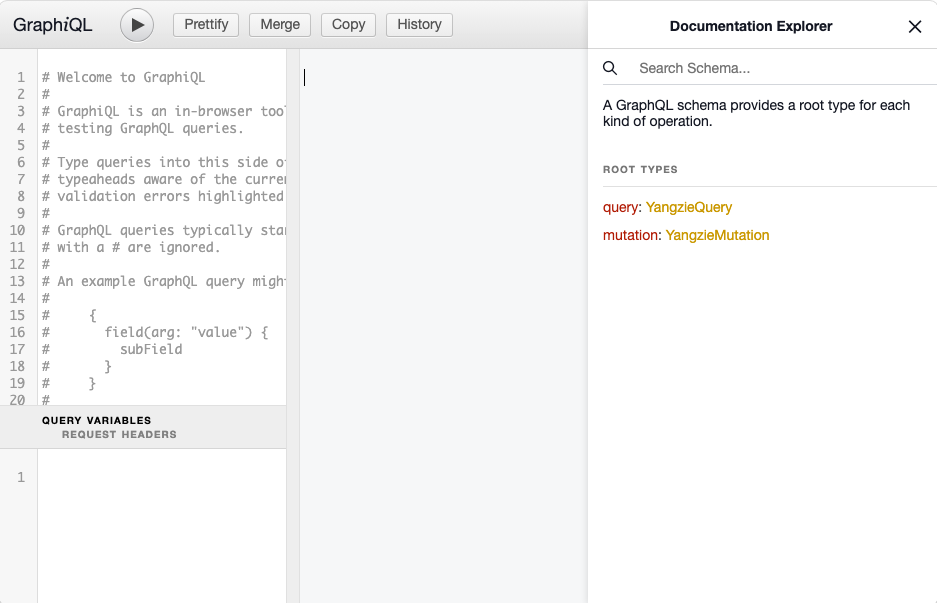

> 提示：GraphQL 可以让客户端直接查询数据库的数据，而无需编写中间的接口，这带来了一定的便利，但同时也存在一定的安全隐患，开发者需要清楚这一点；然后在决定是否该提供Graphql支持。

yangzie自带graphql支持，客户端可通过访问/graphql地址（访问的是graphql模块），然后按照Graphql规范提交参数，即可实现graphql查询和修改；默认情况下，Yangzie 的 model 都不支持 GraphQL 查询。如果希望某个 model 允许被 GraphQL 查询，只需让 model 中的 `is_enable_graphql` 返回 true 即可，还可以在该方法中通过权限来控制是否支持 GraphQL。

Model 的字段及其外键关联的 model，Yangzie 都已处理成了 GraphQL 的 query，无需开发者做任何处理，便可通过 GraphQL 查询。Yangzie 自带一个 GraphiQL 客户端，通过访问 /graphql-client 即可使用，从客户端中可以便捷地了解系统支持哪些查询，也可以在这里测试自己写的 GraphQL 的 query 语句。

对于 model 的单表保存和删除操作，Yangzie 也提供了对应的 mutation：`save[表名]` 和 `remove[表名]`。

**Yangzie GraphQL 的写法**:

任何前端系统都可以通过 HTTP 调用 Yangzie 中的 GraphQL 查询，查询语法和返回结果满足 GraphQL 的规范（<https://graphql.org/learn/>）。

### Model查询参数

在用 GraphQL 查询具体某个Model时，自带三个参数：

- `id`: 通过id主键查询单个对象
- `wheres`: Where的数组，指定查询条件
  - `column`: String! 查询字段名
  - `op`: String! 比较条件，比如=，like等
  - `value`: [String] 查询值
  - `andor`: String `And` / `Or` 拼接下一个where
- `clause`: Clause类型，指定查询的排序、分页、统计等信息
  - `orderBy`: String 排序字段
  - `sort`: String `ASC` / `DESC`
  - `groupBy`: String 分组字段
  - `page`: Int 当前页 默认 1
  - `limit`: Int 每页大小 默认 10

示例：

```graphql
{
  users(clause:{limit: 3}){
    id
    name
  }
}
```

返回结果：

```json
{
  "data": {
    "users": [
      {
        "id": 1,
        "name": "只读管理员"
      },
      {
        "id": 2,
        "name": "系统测试"
      },
      {
        "id": 3,
        "name": "11jianqu"
      }
    ]
  }
}
```

### 依赖Model之间的查询

Graphql查询model时，除了能查询自己的字段外，如果数据库设计上有关联关系，也可以查询依赖的Model字段数据，查询的字段名根据依赖的字段生成，比如foo model有字段bar_id，那么可以通过查询bar这个field查询bar model的字段:

```graphql
{
  foo(clause:{limit: 3}){
    id
    bar {
      name
    }
  }
  count{
    foo
  }
}
```

### 自定义 Model 的 field

model除了自身的字段可以作为Query的field外，开发者可以根据自己的业务逻辑定义各种可被graphql查询的field，方法就是通过Model的custom_graphql_fields和query_graphql_fields方法

#### custom_graphql_fields 定义自定义查询字段

该方法返回一个数组，数组的key是field的名称，value是GraphqlField对象，示例：

```php
public static function custom_graphql_fields(){
  return [
    'myOrder'=>new GraphqlField('myOrder', new GraphqlType('order'), '订单'),
    'stop_reason_text'=>new GraphqlField('stop_reason_text', new GraphqlType('String','',GraphqlType::KIND_SCALAR), '结束原因')
  ];
}
```

**GraphqlField**:

通过该对象可以定义各种复杂的类型，GraphqlField的定义如下

```php
GraphqlField($name, GraphqlType $type, $description="", $args=[], $isDeprecated=false, $deprecationReason=null)
```

- name就是field的名称
- type就是field的类型，是一个GraphqlType对象
- description是field的描述
- args是field的参数，是一个数组，数组的每个元素都是一个GraphqlArgument对象
- isDeprecated是field是否被废弃
- deprecationReason是field被废弃的原因

**GraphqlType**:

定义field的类型，他可以是系统的model对象，也可以是Graphql定义的标量值，列表等，GraphqlType的定义如下：

```php

GraphqlType(string $name=null, string $description=null, string $kind = GraphqlType::KIND_OBJECT, GraphqlType $ofType=null, array $fields=[], array $interfaces=[], array $possibleTypes=[], array $enumValues=[], array $inputFields=[], string $specifiedByURL="" )

```

- name 类型名称, 如果是系统的model，可以直接填写model名，如`new GraphqlType('order')`
- description 类型的描述
- kind 具体的类型，默认`GraphqlType::KIND_OBJECT`，完整的类型参考官方文档
- ofType 上级类型

以下字段这里不做描述，用途请参考graphql官方文档

- fields
- interfaces
- possibleTypes
- enumValues
- inputFields
- specifiedByURL

其他示例：

- 定义标量数据
  
  ```php
  ['done_time' => new GraphqlField('done_time', new GraphqlType('Date','',GraphqlType::KIND_SCALAR), '核销时间')],
  'real_pay_price' => new GraphqlField('real_pay_price', new GraphqlType('Float','',GraphqlType::KIND_SCALAR), '实际应付金额')
  ```

- 定义一组数据
  
  ```php
  'status_logs' => new GraphqlField('status_logs', new GraphqlType('', '', GraphqlType::KIND_LIST, new GraphqlType('order_status_log')))
  ```

  注意这里List没有类型名称，并且要指定List中的item所属的类型，示例中是`GraphqlType('order_status_log')`

#### query_graphql_fields 实现自定义查询字段如何查询

由该方法来实现自定义的查询字段该如何查询，该方法只有一个参数：`GraphqlSearchNode $searchNode`，该参数封装了graphql查询的内容，他的代码如下：

```php
class GraphqlSearchNode{
    /**
     * @var string 查询内容
     */
    public $name;

    /**
     * @var array<GraphqlSearchArg>
     */
    public $args;
    /**
     * @var 别名
     */
    public $alias;
    /**
     * @var array<GraphqlSearchNode>
     */
    public $sub;
    public function has_value(){
        return $this->name;
    }
}
```

- name: 查询字段名称
- args: 查询字段的参数，是一个数组，数组的每个元素都是一个GraphqlSearchArg对象
- alias: 查询字段的别名
- sub: 查询字段的子查询，是一个数组，数组的每个元素都是一个GraphqlSearchNode对象

query_graphql_fields方法中只要判断name是否是自定义的查询字段，从而实现自定义查询即可，如果name查询的类型就是model，则可以直接交给`model->model_get()`方法。

示例：

- 查询model

  ```php
    if ($searchNode->name == "myOrder"){
      $myOrder = getMyOrder();
      return $myOrder ? $myOrder->model_get($searchNode) : null;
    }
  ```

- 查询一组model

  ```php
  if ($searchNode->name == "status_logs"){
    $_ = [];
    foreach (get_order_status_logs() as $item){
      $_[] = $item->model_get($searchNode);
    }
    return $_;
  }
  ```

- 查询表量

  ```php
  if ($searchNode->name == "done_time"){
    $done_log = Order_Status_Log_Model::from()->where("order_id=:oid and `status`='done'")->getSingle([':oid'=>$this->id]);
    return $done_log ? $done_log->date : null;
  }
  ```

#### 预定义的count字段

该字段count返回查询的model满足条件的总记录数

示例：

```graphql
{
  users(clause:{limit: 3}){
    id
    name
  }
  count{
    users
  }
}
```

返回结果

```json
{
  "data": {
    "users": [
      {
        "id": 1,
        "name": "只读管理员"
      },
      {
        "id": 2,
        "name": "系统测试"
      },
      {
        "id": 3,
        "name": "11jianqu"
      }
    ],
    "count": {
      "users": 9994
    }
  }
}
```

### 自定义 query

以上介绍的查询或者自定义查询字段都是在已有的model基础实现，他通常只能实现单表查询以及查询出有明显依赖关系的model数据，实际的业务系统中的复杂需求，比如涉及到多表的联合查询则需要通过自定义query的方式来实现graphql查询。这通过`YZE_GRAPHQL_CUSTOM_QUERY_TYPE`和`YZE_GRAPHQL_CUSTOM_SEARCH`两个Hook来实现。

#### YZE_GRAPHQL_CUSTOM_QUERY_TYPE

该Hook注册自定义的查询类型GraphqlCustomType，他是一个Filter，这意味着多个挂在的hook函数之间是串行的，每个hook函数的返回值都会作为下一个hook函数的参数，他传入一个引用类型的参数`&$types`，每个注册的hook函数都在该参数里加入自定义的查询类型GraphqlCustomType。

**GraphqlCustomType：**：
该类型集成自GraphqlType，用于定义查询的字段和查询的输入参数：

```php
class GraphqlCustomType extends GraphqlType {
    /**
     * 查询参数数组
     * @var array<GraphqlInputValue>
     */
    public $args = [];
    /**
     * 是否弃用
     * @var bool
     */
    public $isDeprecated = false;
    /**
     * 弃用原因，如果没有弃用必须返回null
     * @var null
     */
    public $deprecationReason = null;

    /**
     * @param string|null $name
     * @param string|null $description
     * @param string $kind
     * @param array<GraphqlInputValue> $args
     * @param bool $isDeprecated
     * @param $deprecationReason
     */
    public function __construct(string $name=null, string $description=null, array $args=[], string $kind = GraphqlType::KIND_OBJECT, bool $isDeprecated=false, $deprecationReason=null)
    {
        parent::__construct($name, $description);
        $this->fields = [];
        $this->kind = $kind;
        $this->args = $args;
        $this->isDeprecated = $isDeprecated;
        $this->deprecationReason = $deprecationReason;
    }
    public function get_data()
    {
        return parent::get_data();
    }
}
```

hook函数示例：

```php
YZE_Hook::add_hook(YZE_GRAPHQL_CUSTOM_QUERY_TYPE, function (&$types){
    $user = YZE_Hook::do_hook(YZE_HOOK_GET_LOGIN_USER);
    $type = new GraphqlCustomType("queryOrder", "订单查询"); //自定义查询名称和描述
    $result = Order_Model::all_graphql_Fields($user);
    $type->fields = $result;// 设置查询的字段
    // 设置查询的参数
    $type->args = [
        new GraphqlInputValue("query", new  GraphqlType("String", null,  GraphqlType::KIND_SCALAR),"搜索名称"),
        new GraphqlInputValue("shop_id", new  GraphqlType("String", null,  GraphqlType::KIND_SCALAR),"商家id;多个商家id用,分隔"),
        new GraphqlInputValue("biz_type", new  GraphqlType('product_biz_type', null,  GraphqlType::KIND_ENUM),"业务类型"),
        new GraphqlInputValue("page", new  GraphqlType("Int", null,  GraphqlType::KIND_SCALAR),"当前页"),
        new GraphqlInputValue("limit", new  GraphqlType("Int", null,  GraphqlType::KIND_SCALAR),"每页条数")
    ];
    // 往hook参数中加入自定义查询类型
    $types[] = $type;
    return $types;
});
```

#### YZE_GRAPHQL_CUSTOM_SEARCH

该Hook参数是一个引用数组，内容是`['search'=>GraphqlSearchNode, 'total'=>0, 'rsts'=>[]]`，里面的search是GraphqlSearchNode对象，total是查询出的总记录数，rsts是具体的查询结果；跟query_graphql_fields方法一样，该hook注册函数需要判断查询的字段名然后做对应的业务查询，并把结果设置给参数里面对应的数组项：

```php
YZE_Hook::add_hook(YZE_GRAPHQL_CUSTOM_SEARCH, function (&$data){
    $searchNode = $data['search'];
    if ($searchNode->name != "queryOrder") return $data;
    $total = 0;
    $rsts = [];
    // to do search
    $data['total'] = $total;
    $data['rsts'] = $rsts;
});
```

## 第九章 i18n

扬子鳄采用 Pomo 库来实现 i18n 多语言翻译，这需要开发者在输出、展示内容的地方用 `\_\_` 函数或者 `_e` 函数来输出内容。

```php
\_\_($text, $domain):
```

该函数返回经过翻译后的 text 内容。

```php
_e($text, $domain):
```

该函数输出（echo）翻译后的 text 内容。

当项目开发到一定阶段后，用 poedit 软件打开 /i18n 目录中的 zh-cn.po，用该软件扫描整个项目，它会把项目中所有调用 `\_\_` 和 `_e` 的字符串提取出来，然后翻译人员可以针对每句话逐句翻译成你期望的语言。关于 poedit 的用法请自行查询网络资料，这里仅说明在 yangzie 中调用 \_\_ 和 _e 的注意事项。

1. `$text` 必须是完整的语句。如果其中有可变内容，应该采用 vsprintf 这些函数配合占位符输出，比如 `\_\_("hello ".$name)` 应该写成 `vsprintf(\_\_("hello %s"), $name)`，这样在翻译时就能完整地提取语句 `hello %s` 进行翻译
2. 翻译后的 po、mo 文件放在 /i18n 目录中
3. Yangzie 默认会通过浏览器请求的 `HTTP_ACCEPT_LANGUAGE` 获取语言，然后调用对应的 mo 文件。开发者也可以在系统中做语言切换功能，通过 `YZE_HOOK_GET_LOCALE` hook 设置对应的语言即可

## 第十章 Hook

为了方便在已有的逻辑上扩展定制功能，遵循"对扩展开放，对修改关闭"的原则，Yangzie 提供了 Hook 机制来对已有的处理逻辑进行扩展。Hook 的作用是：

1. 数据输入、输出处理：类似于 filter，对输入数据或者输出数据进行过滤处理
2. 事件通知
3. 模块之间功能调用

Hook 也就是一个名字及绑定在其上的回调函数。回调函数根据其作用会传入相关的参数，扬子鳄预设了一些 Hook，开发者也可以自定义，只需要遵循 Yangzie 的 Hook 规定即可。Hook 的使用分三步：定义 Hook、注册回调函数和触发 Hook。Yangzie 的 hook 处理的方式是：

1. 在系统启动前加载所有 hook 目录中的 hook 函数；
2. 通过 `do_hook($hook_name, $args)` 调用 hook，args 会传入 注册的hook 函数。

**定义 Hook**：

Hook 主要是通过 Name 来区别，定义 Hook Name 的方式就是通过定义 PHP 常量，只需要 Hook Name 直观即可。每个 module 都有一个 hooks 目录，里面的 php 文件 Yangzie 会自动包含，可以把自定义的 hook 名放置在里面。

**注册 Hook：YZE_Hook::add_hook**：

```php
YZE_Hook::add_hook ( "Hook名", function  ( &$data ) {
    // Hook处理逻辑
} )
```

传入 hook 的参数 data 根据 hook 的用途由开发者自己定义。对于 filter 类型的 hook，则可以通过引用的方式传入，这时如果有多个 hook 注册函数，那么上一个 hook 处理后的 data 会传入下一个 hook 函数；对于其他类型的 hook，则仅仅是传入数据。

**触发 Hook YZE_Hook::do_hook**：

`YZE_Hook::do_hook("Hook名", 传入的参数数据)`

**多个 hook 的调用顺序**:

如果一个 hook 被注册了多个回调函数，那么这些回调函数的调用顺序是不确定的；系统不应该依赖这些 hook 函数的顺序。

### 系统预设的 Hook

系统的处理流程中预留了许多的 hook，开发者也可以通过 hook 的方式来扩展功能：

- YZE_HOOK_BEFORE_DISPATCH
  - 在请求交由控制器处理前触发，这时已经经过了 auth 和权限校验
  - 无参数
- YZE_HOOK_AFTER_DISPATCH
  - 在控制器处理完请求后触发
  - 无参数
- YZE_HOOK_MODEL_UPDATE
  - 模型被更新后触发
  - 参数是被更新的 model 对象
- YZE_HOOK_MODEL_INSERT
  - 模型被插入后触发
  - 参数是被插入的 model 对象
- YZE_HOOK_MODEL_DELETE
  - 模型被删除后触发
  - 参数是被删除的 model 对象
- YZE_HOOK_MODEL_SELECT
  - 模型被查询后触发
  - 参数是被查询出来的 model 对象数组
- YZE_HOOK_BEFORE_DO_EXCEPTION
  - 在控制器出现异常后进入控制器的 exception 前触发
  - 参数是控制器对象
- YZE_HOOK_YZE_EXCEPTION
  - 在整个处理流程出现异常后进行的处理，也就是整个请求最后处理异常的地方
  - 参数是一个数组：["exception"=>当前的异常对象，"controller"=>当前控制器对象,"response"=>当前要返回前端的响应对象]
- YZE_HOOK_GET_USER_ARO_NAME
  - 获取当前登录用户的 aro 名字，也就是 acl 控制中登录用户的角色名
  - 返回 aro 字符串
- YZE_HOOK_FILTER_URI
  - 解析地址得到请求 url
- YZE_HOOK_GET_LOGIN_USER
  - 获取当前的登录用户
  - 无参数
- YZE_HOOK_SET_LOGIN_USER
  - 设置当前登录用户
  - 参数为当前登录用户
- YZE_HOOK_AUTO_LOAD_CLASS
  - 处理未能识别的 class 的文件包含
  - 参数是 class 的完整名字
- YZE_HOOK_GET_LOCALE
  - 设置当前语言
- YZE_GRAPHQL_CUSTOM_QUERY_TYPE
- YZE_GRAPHQL_CUSTOM_SEARCH

## 第十一章 单元测试

yangzie采用PHPT作为单元测试工具，他是 PHP 官方自带的测试文件格式（PHP 源码及扩展测试均使用此格式），扩展名为 `.phpt`。它本质上是一个**文本文件**，通过 `--XXX--` 分隔符把"测试说明、测试代码、期望输出"等段落（section）组织在一起，由 `run-tests.php` 负责执行并比对结果。

特点：

- 无需安装任何测试框架，PHP 官方包自带 `run-tests.php`；
- 一个文件即一个测试用例，轻量、可读、易维护；
- 支持跳过条件、环境变量、php.ini 设置、HTTP 模拟等多种能力。

他的用法非常简单，开发者也可以选择自己喜欢的单元测试工具进行测试；只需要注意yangzie是单入口框架，
对于框架的处理流程，默认的工作目录是app/public_html，在用其他测试工具时自行看情况进行调整，比如可能需要在自己的单元测试代码中先把工作目录切换到yangzie的工作目录中在写测试代码：

```php
chdir("PATH/TO/app/public_html");
include "init.php";
```


### 二、文件结构

yangzie的单元测试文件是在tests目录中，对应script生产的controller，model文件都会自动在该目录中生成对应的phpt文件，开发者直接在对应的文件中写测试即可。 一个最简单的 phpt 由 3 个必填 section 组成：

```
--TEST--           测试用例名称（必填，将显示在运行结果里）
--FILE--           测试代码（必填，通常是 <?php ... ?>）
--EXPECT--         期望的输出（必填，与 --FILE-- 的执行结果逐字符比对）
```

以本项目 `tests/yangzie/sql-from.phpt` 为例：

```phpt
--TEST--
YZE_SQL 测试（单表FROM）
--FILE--
<?php
namespace  yangzie;
chdir(dirname(dirname(dirname(__FILE__)))."/app/public_html");
include "init.php";

class TestModel extends YZE_Model{
    // ... 测试模型定义
}

$sql = new \yangzie\YZE_SQL();
$sql->from(TestModel::class);
echo $sql,"\r\n";
?>
--EXPECT--
SELECT m.id AS m_id,m.title AS m_title,... FROM `tests` AS m
```

运行逻辑：`run-tests.php` 把 `--FILE--` 的代码写入临时文件并执行，将实际输出与 `--EXPECT--` 比对，完全一致则 PASS，否则 FAIL 并生成 diff 供排查。

### 三、常用 section 详解

| Section | 必填 | 作用 |
| --- | --- | --- |
| `--TEST--` | 是 | 用例名称，展示在运行结果中 |
| `--FILE--` | 是 | 测试代码，正常以 `<?php` 开头 |
| `--EXPECT--` | 是* | 期望输出，与运行结果**逐字节**精确比对 |
| `--EXPECTF--` | 否 | 期望输出，支持 `%d`、`%s` 等**通配符**（见第四节） |
| `--EXPECTREGEX--` | 否 | 期望输出，按 **PCRE 正则**匹配 |
| `--EXPECTEXIT--` | 否 | 期望的退出码（如 `0`、`1`），PHP 8.4+ |
| `--SKIPIF--` | 否 | 满足条件时跳过本用例（返回 `skip` 即跳过） |
| `--CLEAN--` | 否 | 测试结束后执行的清理代码（如删表、删临时文件） |
| `--INI--` | 否 | 仅本次测试生效的 php.ini 设置，每行一个 `key=value` |
| `--ENV--` | 否 | 仅本次测试生效的环境变量，每行一个 `key=value` |
| `--ARGS--` | 否 | 传递给测试脚本的命令行参数（如 `--verbose`） |
| `--GET--` / `--POST--` / `--COOKIE--` | 否 | 模拟 HTTP 请求的 GET/POST/Cookie 数据（配合 CGI 方式运行） |
| `--REQUEST--` | 否 | 原始请求体（需配合 `--POST--` 等使用） |
| `--EXTENSIONS--` | 否 | 声明所需扩展，未加载则跳过（PHP 8.0+） |
| `--CONFLICTS--` | 否 | 声明与哪些扩展冲突 |
| `--FILE_EXTERNAL--` | 否 | 从外部文件读取测试代码（替代 `--FILE--`） |

> `*`：`--EXPECT--`、`--EXPECTF--`、`--EXPECTREGEX--` 三选一必填；测试实际有输出时需提供期望。

#### 1. `--TEST--`

```phpt
--TEST--
YZE_SQL 测试（单表FROM）
```

#### 2. `--SKIPIF--` 跳过条件

返回内容包含 `skip` 字样时跳过该用例，常用于"环境不满足则跳过"：

```phpt
--SKIPIF--
<?php
if (!extension_loaded('pdo_mysql')) die('skip 需要 pdo_mysql 扩展');
if (!file_exists(__DIR__.'/db_config.php')) die('skip 缺少数据库配置');
?>
```

#### 3. `--INI--` 与 `--ENV--`

```phpt
--INI--
error_reporting=E_ALL
display_errors=1
--ENV--
YANGZIE_ENV=test
DB_HOST=127.0.0.1
```

#### 4. `--ARGS--`

```phpt
--ARGS--
-h
--FILE--
<?php
// 以 php test.php -h 的方式运行
var_dump($argv);
?>
--EXPECT--
array(2) {
  [0]=>
  string(8) "test.php"
  [1]=>
  string(2) "-h"
}
```

#### 5. `--CLEAN--` 清理

测试执行后运行，用于清理数据库表、临时文件等，避免影响其他用例：

```phpt
--CLEAN--
<?php
@unlink(__DIR__.'/tmp_upload.txt');
?>
```

#### 6. 数据库测试示例

```phpt
--TEST--
数据库事务测试（单数据库）
--FILE--
<?php
namespace  yangzie;
chdir(dirname(dirname(dirname(__FILE__)))."/app/public_html");
include "init.php";

$dba = YZE_DBAImpl::get_instance();
$dba->begin_Transaction();
$dba->exec("insert into tests_rollback(title) values('{$title}')");
var_dump($dba->in_transaction());
$dba->rollBack();
var_dump($dba->in_transaction());
?>
--EXPECT--
bool(true)
bool(false)
```

要点：项目用例中统一 `chdir` 到 `app/public_html` 后 `include "init.php"` 引导框架，这与框架初始化方式有关，新用例照此结构编写即可。

### 四、`--EXPECTF--` 通配符

当输出包含动态内容（时间戳、随机值、内存地址等）时使用 `--EXPECTF--` 代替 `--EXPECT--`：

| 通配符 | 含义 | 示例 |
| --- | --- | --- |
| `%s` | 任意**非空**字符串（不含换行） | `%s` 匹配 `mysql` |
| `%S` | 空字符串或任意字符串 | `%S` 匹配空或 `mysql` |
| `%a` | 任意字符串（含换行） | `%a` 匹配多行内容 |
| `%A` | 空或任意字符串（含换行） | `%A` |
| `%d` | 无符号十进制整数 | `%d` 匹配 `123`、`0` |
| `%i` | 带符号十进制整数 | `%i` 匹配 `-12`、`+3` |
| `%f` | 浮点数 | `%f` 匹配 `3.14` |
| `%x` | 十六进制数字 | `%x` 匹配 `deadbeef` |
| `%c` | 单个字符 | `%c` 匹配 `a` |
| `%e` | 目录分隔符（平台相关，Windows 为 `\`） | `%e` 匹配 `\` 或 `/` |
| `%r...%r` | 内部为正则表达式 | `%r\d{4}-\d{2}-\d{2}%r` 匹配日期 |

示例：

```phpt
--TEST--
时间戳输出匹配
--FILE--
<?php
echo date('Y-m-d H:i:s'), "\n";
echo "user id: 1024\n";
?>
--EXPECTF--
%s
user id: %d
```

注意：`--EXPECTF--` 中 `%` 是转义符，需要匹配字面 `%` 时写 `%%`；`--EXPECTREGEX--` 则整个内容按正则处理（正则中无 `%` 转义问题）。

### 五、运行方式

#### 1. 本项目运行

`tests/` 目录已集成官方 `run-tests.php` 与启动脚本，先确认 `tests/config.php` 中 `TEST_PHP_EXECUTABLE` 指向本机 PHP 路径：

```php
// tests/config.php
putenv("TEST_PHP_EXECUTABLE=/usr/local/opt/php@7.4/bin/php"); // 修改为本机 php 路径
putenv("TEST_PHP_DETAILED=0");   // 1 或 0，日志详细级别
putenv("TEST_PHP_LOG_FORMAT=LD");// 失败时生成的文件类型：L=log E=exp O=out D=diff
```

然后执行：

```bash
# 进入 tests 目录
cd tests

# 运行全部用例（非 Windows）
php autorun.php

# 运行指定用例
php autorun.php yangzie/sql-from.phpt

# Windows 下用 bat
autorun.bat
autorun.bat yangzie/sql-from.phpt
```

`autorun.php` 实际就是封装了 `php run-tests.php`：

```php
// tests/autorun.php
if(@$argv[1]){
    system("php run-tests.php {$argv[1]}");
}else{
    system("php run-tests.php ./");
}
```

#### 2. 直接使用官方 run-tests.php

```bash
# 运行指定文件或目录
php run-tests.php tests/yangzie/sql-from.phpt
php run-tests.php tests/yangzie/

# 指定 PHP 可执行文件
php run-tests.php -p /usr/local/bin/php tests/

# 指定 ini 设置（可多次）
php run-tests.php -d extension=pdo_mysql tests/

# 不加载 php.ini
php run-tests.php -n tests/

# 静默模式（只输出摘要）
php run-tests.php -q tests/

# 失败时直接显示 diff
php run-tests.php --show-diff tests/

# 保留所有生成文件（.out/.exp/.diff/.log）
php run-tests.php --keep-all tests/
```

常用环境变量：

| 环境变量 | 作用 |
| --- | --- |
| `TEST_PHP_EXECUTABLE` | PHP 可执行文件路径（本项目在 `config.php` 中设置） |
| `TEST_PHP_ARGS` | 传给测试进程的附加参数 |
| `TEST_PHP_DETAILED` | 是否输出详细日志 |
| `TEST_PHP_LOG_FORMAT` | 失败时生成的文件格式，如 `LEOD` |
| `TEST_PHP_USER` | 用户输出目录 |

### 六、运行结果解读

```
TEST 1/5 [tests/yangzie/sql-from.phpt]
PASS YZE_SQL 测试（单表FROM）
...
Number of tests :    5                 5
Tests skipped   :    0 (  0.0%) --------
Tests warned    :    0 (  0.0%) --------
Tests failed    :    1 ( 20.0%) --------
Expected fail   :    0 (  0.0%) --------
Tests passed    :    4 ( 80.0%) --------
```

失败时会生成同名辅助文件（由 `TEST_PHP_LOG_FORMAT` 控制）：

| 后缀 | 内容 |
| --- | --- |
| `.out` | 测试实际输出 |
| `.exp` | 期望输出 |
| `.diff` | 差异对比（`-` 期望，`+` 实际） |
| `.log` | 完整运行日志 |

排查流程：先看 `.diff` 定位差异，再结合 `.log` 看是否由环境（扩展缺失、路径、换行符）导致。

### 七、编写规范与常见坑

1. **文件命名**：`<类名或功能>-<场景>.phpt`，如 `sql-where.phpt`、`dba-transaction-one.phpt`，与框架类文件命名习惯一致。
2. **必须使用 `--TEST--`**：名称清晰描述被测功能，便于失败定位。
3. **无 BOM、统一换行**：`.phpt` 是纯文本，**不要带 UTF-8 BOM**；`--EXPECT--` 与输出做逐字节比对，注意 `\r\n` / `\n` 差异（本项目用例输出用 `"\r\n"`，期望里需保持一致）。
4. **自包含**：用例应自行建表、清理数据（`--FILE--` 建表、`--CLEAN--` 清理），不依赖执行顺序。
5. **动态输出用 `--EXPECTF--`**：时间戳、随机 id、路径等一律用通配符，避免偶发 FAIL。
6. **环境敏感用 `--SKIPIF--`**：依赖特定扩展/配置时先做检查并 `skip`，保证其他环境可跑。
7. **namespace 与引导**：本项目用例统一 `namespace yangzie;` + `chdir(...)` + `include "init.php"`，新用例照抄开头即可；模型类定义在用例文件内（如 `class TestModel extends YZE_Model`），避免与全局命名冲突。
8. **`<?php ?>` 结尾可省略**：`--FILE--` 末尾的 `?>` 非必须，但保留时注意其后不能有多余空行，否则会作为输出的一部分。
9. **退出码校验**（PHP 8.4+）：需要断言进程退出码时用 `--EXPECTEXIT--`：

    ```phpt
    --EXPECTEXIT--
    255
    ```

## 第十二章 其他

### 命名约定

大部分框架都建议采用驼峰命名，yanzie也是如此，但我们建议单词之间用`_`分割

#### 类命名约定

- Yangzie 的类命名采用 Foo_Bar 的格式，单词之间以下划线分隔，单词首字母大写。
- Yangzie 框架的 class 都是自动包含的，不需要人工 include。这些 class 包含 composer 安装的第三方库，它们会被安装到 /vendor 目录中，框架会自动包含。
- 自己写的库代码，按约定放置在 app/vendor 目录中，并用 app\vendor 作为命名空间，那么在使用的地方通过 use 语句即可，不需要手动 include php 文件。
- 对于其他没有按照框架约定的文件，比如老旧文件、手动下载的库（也建议放到 app/vendor 中），则可以通过 hook YZE_HOOK_AUTO_LOAD_CLASS 来处理如何 include。该 hook 默认在 app/hooks/autoload.php 中处理，传入的是要使用的类全名，开发者根据传入的全名自行判断如何 include php 文件。

框架组成部分的类命名是：

- **model**命名是 [数据库表]_Model；对应的业务 trait 是 [数据库表]_Model_Method
- **控制器**命名是 [控制器名]_Controller
- **自定义View**命名 [视图名]_View

#### 文件命名约定

- 文件名都采用小写，避免在不同都操作系统上出现文件包含问题
- 

#### 命名空间

代码的命名空间都从 app 开始，跟其他语言一样，命名空间也就是目录结构。
一个例外就是 modules 下的类的命名空间省略掉 modules，并且命名空间只到模块名，不用包含里面的 controllers 这些。比如 foo 模块里面的 bar 控制器，其目录结构是 app/modules/foo/controllers/bar.controller.php，它的命名空间是 app/foo。

### 启动顺序及处理流程

扬子鳄是单入口模式，也就是所有的请求都由 public_html/index.php 进行处理。这是扬子鳄的处理入口：

1. 从这里开始，扬子鳄会先对请求的 URI 进行解析，从而知道应该由哪个模块、哪个控制器、哪个 action 来负责处理请求
2. 但是在 action 开始处理前，扬子鳄会根据模块的配置来决定是否需要进行身份认证
3. 身份认证过后再决定是否需要权限控制
4. 当这些都没有问题后，才把控制权交给 action
5. 然后处理响应：action 的响应会先进行处理，然后是 master view，最后才输出 layout

### 字符过滤

Yangzie 会对请求获取的数据、从数据库中读取的数据进行转义，目的是防止开发者直接输出这些数据时导致 XSS 的可能。比如用户提交的数据中包含 \<script\>\</script\>，那么在输出该数据时，由于扬子鳄已经对这些数据进行了 HTML 转义，数据内容已经变成了 &lt;script&gt;&lt;/script&gt;。直接输出时这是安全的，界面上也会展示出 \<script\>\</script\>，而不是变成 HTML 代码中可以执行的脚本。如果开发者向前端输出这些数据时，明确需要将其作为可执行代码，则需要调用 html_entity_decode 解码后再输出。

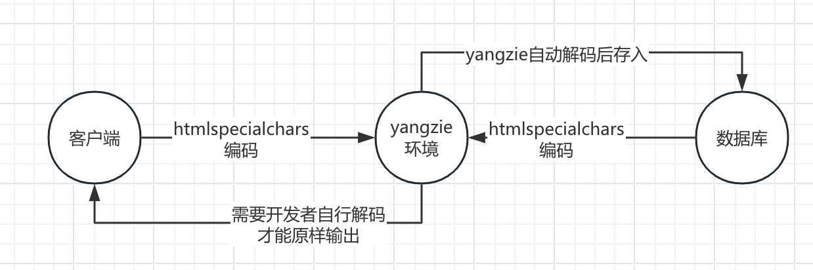

所以在 Yangzie 中输出时，需要主动调用 html_entity_decode 解码后才能输出原始内容，避免开发者一不小心输出未编码的内容而导致 XSS 攻击。

### .env配置

类似于数据库连接信息，接口访问密钥等敏感的数据，yangzie都建议配置在.env文件中，该文件是一个文本文件，采用name=value的方式配置，一行一个配置项目。然后需要使用的地方通过env()方法来获取，该方法是YZE_Object基类的方法，所以任何继承该类的对象都可以调用该方法（Controller，Request，Model）

基本的配置可参考：

```yaml
db_type = "" #数据库类型，目前支持mysql
db_host = "127.0.0.1" #地址
db_user = "" #数据库用户名
db_psw = "" #数据库密码
db_port = "" #数据库端口
db_charset = "utf8" #字符集
crypt_key = "" #数据库加密解密的密钥
```
